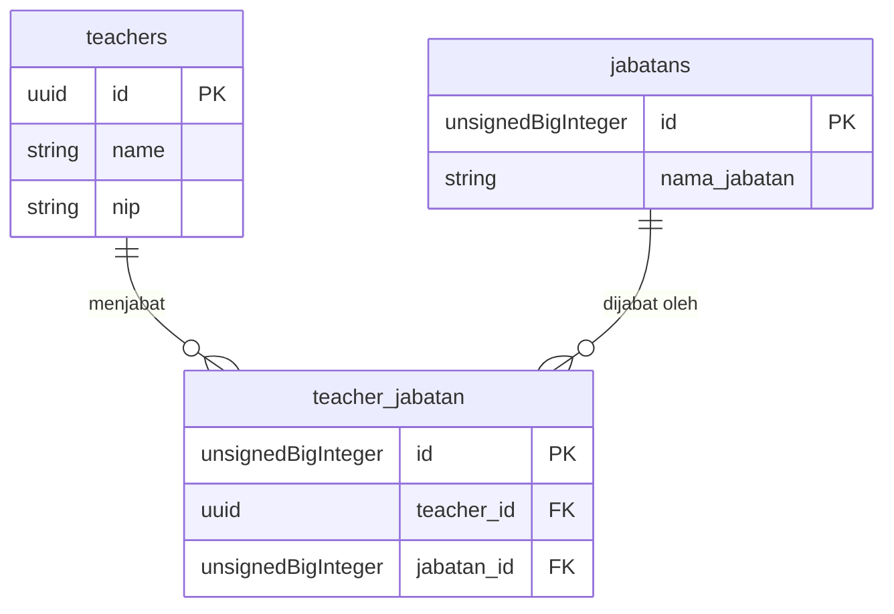

# 02. Modul Kepegawaian (HRD)

Modul Kepegawaian (HRD) mengelola entitas guru, staf, serta jabatan fungsional maupun struktural di sekolah.

---

## 1. Entitas Guru (`teachers`)
Tabel `teachers` memuat identitas guru dan digunakan sebagai entitas otentikasi (Guard `wali_kelas`).

**Atribut Utama:**
- `name`: Nama lengkap beserta gelar.
- `nip`: Nomor Induk Pegawai (Unik, opsional).
- `username`: Kredensial login.
- `password`: Kredensial rahasia.

---

## 2. Entitas Jabatan (`jabatans`)
Tabel `jabatans` memuat master data jabatan yang ada di sekolah (misal: "Kepala Sekolah", "Wakil Kepala Sekolah", "Kepala Lab", "Guru Mata Pelajaran", "Wali Kelas").

**Atribut Utama:**
- `nama_jabatan`: Nama representatif jabatan.

---

## 3. Relasi Guru dan Jabatan (Tabel Pivot `teacher_jabatan`)
Sistem mengimplementasikan relasi **Banyak-ke-Banyak (Many-to-Many)** antara Guru dan Jabatan karena seorang guru dapat memiliki lebih dari satu tugas tambahan/jabatan di sekolah.

### Aturan Bisnis (Business Rules) Terkait Jabatan
1. **Jabatan Rangkap:** Sistem mengizinkan seorang guru untuk di-*tag* dengan berbagai jabatan secara bersamaan tanpa menimbulkan konflik data.
2. **Perlindungan Penghapusan Jabatan:** Data Jabatan di tabel `jabatans` **tidak dapat dihapus atau diubah** apabila masih terhubung dengan minimal 1 Guru aktif di tabel `teacher_jabatan`. Admin harus mencopot jabatan dari guru terkait terlebih dahulu sebelum bisa menghapus data master jabatannya (menerapkan konsep *Interactive Blocking Notification* di tahap 14).
