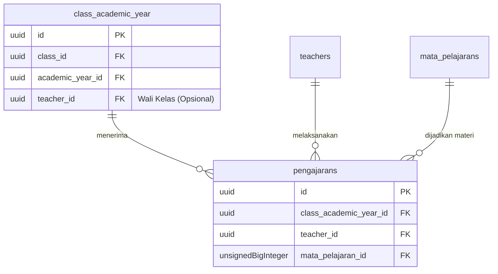

# 03. Modul Akademik

Modul Akademik merupakan jantung operasional pembelajaran yang mempertemukan Entitas Siswa, Guru, dan Kelas melalui dimensi Tahun Ajaran.

---

## 1. Tahun Ajaran (`academic_years`)
Menjadi variabel penentu waktu (dimensi temporal) untuk seluruh entitas operasional. Seluruh relasi operasional (Enrollment dan Pengajaran) terikat pada satu spesifik Tahun Ajaran.
- Sistem dirancang sedemikian rupa agar hanya ada **Satu Tahun Ajaran Aktif**. Saat Admin mengubah status salah satu tahun ajaran menjadi "Aktif", secara otomatis tahun ajaran lama diarsipkan dan setting global diperbarui.

---

## 2. Pendaftaran Kelas (Enrollment / `student_enrollments`)
Relasi pemetaan Siswa ke Kelas.
- Siswa **tidak** secara langsung disematkan ke suatu kelas di profil masternya.
- Tabel pivot `student_enrollments` bertugas memetakan: `Siswa A` + `Kelas 7A` + `Tahun Ajaran 2025/2026`.
- Struktur ini menjamin kelengkapan sejarah (histori akademik) siswa dari jenjang awal hingga lulus/mutasi.

---

## 3. Kurikulum: Mata Pelajaran (`mata_pelajarans`)
Master data seluruh kurikulum (misal: "Matematika", "Bahasa Indonesia").
- **Atribut Utama**: `nama_mapel`, `kode_mapel`.
- **Perlindungan Data**: Tidak dapat dihapus/diubah apabila sedang terikat pada relasi Pengajaran aktif.

---

## 4. Distribusi Jadwal Mengajar (Pengajaran / `pengajarans`)
Relasi kompleks yang menyatukan Guru dengan Kurikulum dan Kelas.

Pikirkan ini sebagai alokasi "Siapa mengajar apa, dan di kelas mana?"
Relasi diwakili oleh tabel `pengajarans` dengan *Foreign Key*:
- `class_academic_year_id` (Merupakan pivot Kelas dan Tahun Ajaran, mewakili spesifik kelas di waktu tertentu, misal "7A - TA 2025/2026").
- `teacher_id` (Guru pengampu).
- `mata_pelajaran_id` (Mata Pelajaran yang diajarkan).

### Aturan Bisnis (Business Rules) Pengajaran
1. Pengajaran menjadi dasar (*baseline*) untuk fitur Jadwal Pelajaran (Timetable) harian di masa depan.
2. Tidak boleh ada duplikasi pengajaran yang sama pada satu kelas dan satu tahun ajaran. Misal: Kelas 7A TA 2025/2026 hanya boleh memetakan 1 guru untuk pelajaran Matematika (kecuali jika dirancang ada *team teaching*, namun secara default dilarang untuk menghindari bentrok jadwal/nilai rapor ganda).
