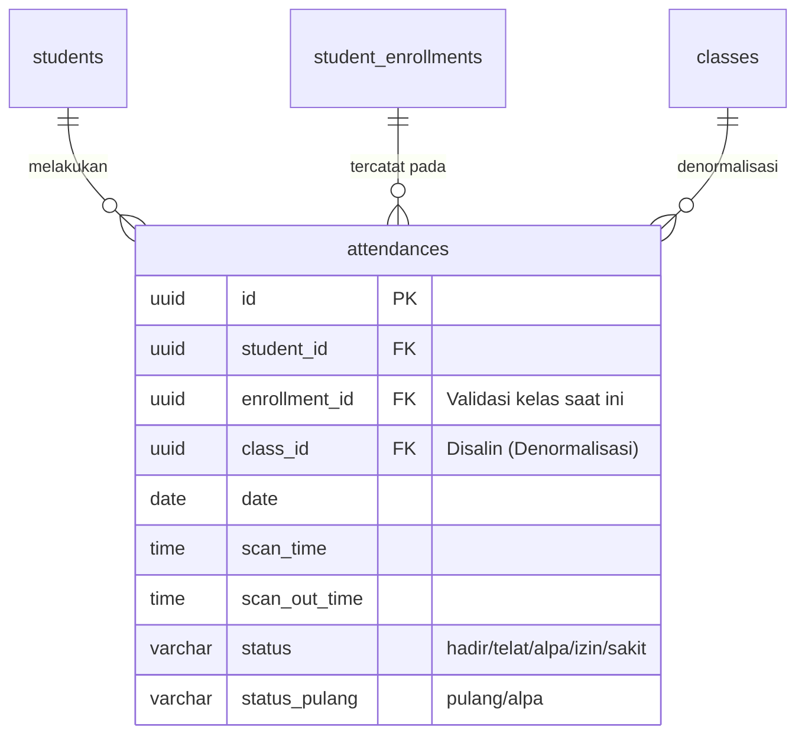

# 04. Modul Presensi

Modul Presensi merupakan sisaan (legacy) utama dari fase pertama (Aplikasi Absensi) yang berpusat pada pencatatan log harian kehadiran siswa melalui alat scanner.

---

## 1. Alat Presensi (`student_presensi_profiles`)
Memisahkan data Master (Siswa murni) dengan data Operasional (Alat presensi).
- Relasi **1-to-1** antara Siswa dan Profil Presensinya.
- Menyimpan `barcode_code` (Kode unik kartu fisik) dan status aktif `barcode_active`.
- Hal ini menjamin perlindungan terhadap data siswa. Jika kartu hilang, admin cukup menonaktifkan `barcode_active` dan membuat barcode baru tanpa menghapus histori presensi lama.

---

## 2. Pengaturan Global (`school_settings`)
Tabel referensi murni berisi satu baris data (*Singleton Pattern* via Filament Settings) untuk mendikte aturan universal sekolah:
- `checkin_time` (jam batas "Hadir" global).
- `late_threshold_minutes` (toleransi menit sebelum dianggap telat).
- `batas_scan_datang_time` (batas maksimal waktu scan kedatangan).
- `start_scan_out_time` (batas minimal waktu scan kepulangan).
- Digunakan untuk kalkulasi dinamis dan otomatis oleh algoritma absensi saat siswa melakukan scan.

---

## 3. Hari Libur (`holidays`)
Mengelola data hari libur sekolah (nasional, cuti bersama, khusus).
- Mendukung fitur *rentang hari* (`start_date` sampai `end_date`).
- Terhubung secara kondisional dengan `class_id` (Misal: kelas 7 libur Ujian Nasional, tapi kelas 8 dan 9 tetap masuk).

---

## 4. Akses Portal Kiosk (`/portal-presensi`)
Akses menuju perangkat pemindai (Kiosk) telah dipisahkan menjadi rute khusus yang dilindungi (*protected route*):
- **URL Login Kiosk:** `/portal-presensi/login`
- **URL Scanner:** `/portal-presensi/scan` (Untuk NISN) dan `/portal-presensi/scan-nis` (Untuk NIS)
- **Role Kiosk:** Hanya pengguna yang memiliki *role* `petugas_presensi` (atau `super_admin`) yang bisa mengakses halaman Kiosk ini. Izin diberikan melalui menu Manajemen Akses Portal di panel Admin.

---

## 4. Pencatatan Kehadiran Harian (`attendances`)
Tabel utama penyimpan log absensi harian yang dirancang dengan **Denormalisasi** untuk optimasi kueri yang berat pada penyajian *dashboard* statistik.

### Algoritma Rekam Absensi Kios Scanner (State-Based)
Pencatatan menggunakan logika berbasis-state transaksi (*Database Transaction Lock*):
1. Membaca string Barcode.
2. Mencari kecocokan `barcode_code` di `student_presensi_profiles`.
3. Memastikan siswa terkait memiliki Pendaftaran Kelas (Enrollment) aktif pada Tahun Ajaran yang saat ini Aktif (ter-set di `school_settings`).
4. Memvalidasi status Hari Libur (`holidays`). Jika hari libur, *scan* ditolak dengan notifikasi libur.
5. Memeriksa keberadaan catatan kehadiran hari ini secara atomik (dengan `lockForUpdate`):
   - **Jika belum absen hari ini (Scan Datang)**:
     - Divalidasi dengan `batas_scan_datang_time`. Jika melewati batas, ditolak.
     - Membandingkan `scan_time` dengan `checkin_time` + `late_threshold_minutes` di `school_settings` untuk menentukan status "hadir" atau "telat".
     - Mencatat kedatangan baru ke `attendances`.
   - **Jika sudah absen hari ini (Scan Pulang)**:
     - Jika status kedatangan adalah "alpa", "sakit", atau "izin" -> Ditolak.
     - Jika belum mencapai waktu `start_scan_out_time` -> Ditolak.
     - Mengisi atribut `scan_out_time` pada rekam yang sama dan memperbarui status pulang.
