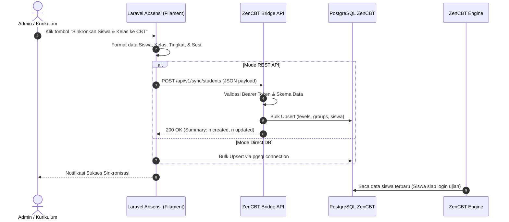
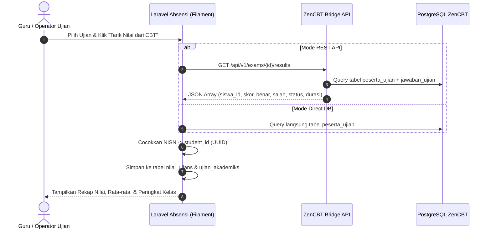

# 01. Arsitektur & Alur Sistem Integrasi ZenCBT

Dokumen ini menjelaskan rancangan arsitektur dan alur kerja integrasi antara sistem **Absensi Sekolah (Laravel + MySQL)** dan sistem **ZenCBT (Go Binary + PostgreSQL)**.

---

## 1. Latar Belakang & Kebutuhan

Di lingkungan sekolah, skenario penempatan infrastruktur server sering kali bervariasi:
1. **Skenario VPS Cloud**: Kedua sistem berada di cloud / VPS yang sama atau jaringan private yang sama.
2. **Skenario Hybrid (Paling Umum di Sekolah)**:
   - **ZenCBT** dipasang di **Server Mini PC / Server Lokal Sekolah (LAN)** agar ujian serentak tidak memakan kuota internet dan tahan terhadap gangguan koneksi eksternal.
   - **Web Absensi & Portal Sekolah** berada di **Cloud VPS** agar bisa diakses oleh wali murid, guru, dan admin dari internet secara 24/7.
3. Membuka port langsung database PostgreSQL (port 5432) ke internet publik berisiko tinggi terhadap keamanan (*brute-force*, kebocoran data) dan sering terhalang NAT / IP dinamis router sekolah.

Oleh karena itu, sistem dirancang dengan pendekatan **Dual-Mode (Hybrid Adapter)**:
* **Mode A (Direct Database)**: Jika kedua aplikasi dalam 1 server / 1 jaringan LAN.
* **Mode B (REST API Bridge)**: Jika ZenCBT dan Absensi berada di lokasi fisik atau cloud yang terpisah.

---

## 2. Diagram Arsitektur Sistem

```
+-------------------------------------------------------------+
|             Aplikasi Absensi & Akademik Sekolah             |
|                   (Laravel 11 + MySQL)                      |
|                                                             |
|   +-----------------------------------------------------+   |
|   |                  CbtSyncService                     |   |
|   |         (Driver Pattern: Database / API)            |   |
|   +--------------------------+--------------------------+   |
+------------------------------|------------------------------+
                               |
               +---------------+---------------+
               |                               |
       [ Mode Database ]                 [ Mode REST API ]
       (Direct pgsql connection)        (HTTP Request + Bearer Token)
               |                               |
               |                               v
               |               +-------------------------------+
               |               |         ZenCBT Bridge         |
               |               |     (Service API Mandiri)     |
               |               +---------------+---------------+
               |                               |
               +---------------+---------------+
                               |
                               v
               +-------------------------------+
               |     ZenCBT Database Engine    |
               |        (PostgreSQL 16)        |
               +---------------+---------------+
                               |
                               v
               +-------------------------------+
               |      Aplikasi Ujian ZenCBT    |
               |     (Go Binary / Web App)     |
               +-------------------------------+
```

---

## 3. Alur Kerja (Workflows)

Integrasi ini mencakup 2 arah aliran data utama:

### Alur 1: PUSH Data Master (Absensi ➡️ ZenCBT)
Dilakukan oleh Admin/Kurikulum menjelang ujian atau awal tahun ajaran baru.



### Alur 2: PULL Nilai & Hasil Ujian (ZenCBT ➡️ Absensi)
Dilakukan setelah sesi ujian selesai untuk merekap nilai ke dalam basis data akademik/rapor.



---

## 4. Aspek Keamanan & Ketahanan (Resilience)

1. **Autentikasi API**:
   - Komunikasi REST API wajib menyertakan HTTP Header:
     `Authorization: Bearer <ZEN_CBT_BRIDGE_SECRET_KEY>`
   - Secret key memiliki panjang minimal 64 karakter acak.

2. **Idempotency (Upsert)**:
   - Proses sinkronisasi bersifat *idempotent* (menggunakan logic `ON CONFLICT` / `upsert`). Menjalankan sinkronisasi berulang kali tidak akan menduplikasi data atau merusak riwayat ujian yang sedang berjalan.

3. **Keamanan Password Siswa**:
   - ZenCBT membutuhkan `password_plain` untuk mencetak kartu ujian dan login siswa CBT.
   - Di sisi Absensi, password siswa yang digenerate untuk CBT adalah format standar yang mudah dicetak (misalnya: NISN, atau format `TGL-LAHIR+NIS`).

4. **Koneksi Terputus / Retry**:
   - Pada aplikasi Laravel Absensi, pemanggilan API dilengkapi dengan mekanisme *timeout* (15-30 detik) dan *retry* (3x) untuk mengantisipasi jaringan sekolah yang fluktuatif.
