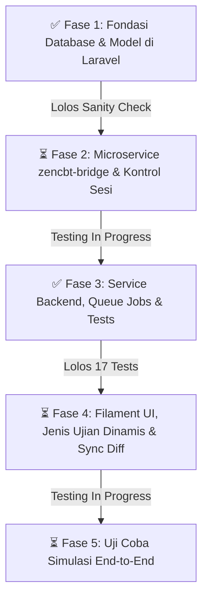

# 08. Rencana Fase Implementasi & Checklist Keamanan (Step-by-Step)

> [!IMPORTANT]
> **Prinsip Utama Eksekusi**:
> 1. Tidak mengerjakan semuanya sekaligus (*no big-bang deployment*).
> 2. Dikerjakan per fase dan per langkah (*incremental steps*).
> 3. Setiap langkah wajib memiliki **Prosedur Pengecekan (*Sanity Check*)** dan **Rencana Rollback** sebelum melangkah ke tahap berikutnya.

---

## 🗺️ Gambaran Umum 5 Fase Eksekusi



---

## 📌 FASE 1: Fondasi Database & Model di Laravel (Non-Destructive)

**Tujuan**: Menyiapkan struktur tabel baru dan kolom pelengkap di MySQL Laravel tanpa mengganggu data presensi, guru, atau siswa yang sudah berjalan.

### Langkah 1.1: Migrasi Penambahan Kolom di Tabel Eksisting
* **Aksi**:
  - `school_settings`: Tambah `active_semester`, `cbt_driver`, `cbt_api_url`, `cbt_api_key`.
  - `mata_pelajarans`: Tambah `kategori`, `kkm_default`.
  - 🛡️ **Tabel `students`: 0% DISENTUH (Nol Perubahan)** untuk memastikan data inti ERP dan modul presensi barcode aman total.
* **Prosedur Pengecekan (*Checking*)**:
  ```bash
  php artisan migrate --pretend # Preview query SQL sebelum dijalankan
  php artisan migrate
  php artisan tinker --execute="echo App\Models\PengaturanSekolah::first()->active_semester;"
  php artisan tinker --execute="echo App\Models\MataPelajaran::first()->kategori;"
  ```
* **Kriteria Lolos**:
  - [x] Query migrasi sukses tanpa error. (Terverifikasi 15 Sep 2026)
  - [x] Data siswa (25), guru, presensi (37), dan mapel lama tetap utuh 100%. (Terverifikasi 15 Sep 2026)
  - [x] Kolom baru memiliki nilai default yang aman (`active_semester = 'ganjil'`, `kategori = 'Umum'`, `kkm_default = 75.00`). (Terverifikasi 15 Sep 2026)
* **Rollback Plan**: `php artisan migrate:rollback --step=1`.

---

### Langkah 1.2: Migrasi Pembuatan Tabel Baru (Termasuk Profil CBT Siswa)
* **Aksi**:
  - Membuat tabel `student_cbt_profiles` (Pola Profile Pattern untuk menampung password kartu dan sesi CBT tanpa menyentuh tabel `students`).
  - Membuat tabel `ujian_akademiks`.
  - Membuat tabel `ujian_akademik_classes`.
  - Membuat tabel `nilai_ujians`.
* **Prosedur Pengecekan (*Checking*)**:
  ```bash
  php artisan migrate
  php artisan tinker --execute="echo Schema::hasTable('student_cbt_profiles') && Schema::hasTable('nilai_ujians');"
  ```
* **Kriteria Lolos**:
  - [x] Keempat tabel baru berhasil dibuat dengan tipe UUID yang sesuai standar project. (Terverifikasi 15 Sep 2026)
  - [x] Unique key `unique(['ujian_akademik_id', 'student_id'])` aktif di tabel `nilai_ujians`. (Terverifikasi 15 Sep 2026)
* **Rollback Plan**: `php artisan migrate:rollback --step=3`.

---

### Langkah 1.3: Pembuatan Model Eloquent & Relasi
* **Aksi**:
  - Buat Model `App\Models\UjianAkademik`.
  - Buat Model `App\Models\NilaiUjian`.
  - Tambahkan relasi di `Siswa.php`, `Kelas.php`, `TahunAjaran.php`, `MataPelajaran.php`.
* **Prosedur Pengecekan (*Checking*)**:
  - Uji via Tinker membuat dummy ujian dan dummy nilai:
  ```php
  // Di php artisan tinker:
  $ujian = App\Models\UjianAkademik::create([...]);
  $nilai = $ujian->nilaiUjians()->create([...]);
  assert($nilai->is_tuntas !== null); // Memastikan auto-kalkulasi KKM jalan
  $ujian->forceDelete(); // Bersihkan kembali
  ```
* **Kriteria Lolos**:
  - [x] Relasi antar model berfungsi dua arah (`$ujian->nilaiUjians` dan `$nilai->siswa`). (Terverifikasi 15 Sep 2026)
  - [x] Event `saving` kalkulasi otomatis status `is_tuntas` berjalan benar. (Terverifikasi 15 Sep 2026)
  - [x] Proteksi RESTRICT constraint pada database engine mencegah penghapusan ujian saat memiliki data nilai. (Terverifikasi 15 Sep 2026)
  - [x] Password kartu ujian di `student_cbt_profiles` terenkripsi otomatis AES-256. (Terverifikasi 15 Sep 2026)

---

## 📌 FASE 2: Pembuatan Service Mandiri ZenCBT Bridge API & Kontrol Sesi

> [!NOTE]
> **Status Fase 2**: ⏳ **DALAM PROSES TESTING (Testing In Progress)**
> Dilakukan penambahan endpoint baru untuk sinkronisasi jadwal ujian (`GET /api/v1/exams`), pembukaan blokir sesi ujian siswa (`POST /api/v1/students/{id}/reset-session`), serta pengaturan sesi eksplisit (`POST /api/v1/students/{id}/set-session`). Endpoint ini sedang dalam tahap pengujian integrasi live.

**Tujuan**: Membangun microservice API ringan di folder `zencbt-bridge` yang terisolasi dari Laravel utama dan langsung berbicara dengan PostgreSQL ZenCBT.

### Langkah 2.1: Inisialisasi Project Bridge & Koneksi PostgreSQL
* **Aksi**:
  - Buat struktur service mandiri di `/home/sutris-remote/Documents/projek-laravel/zencbt-bridge`.
  - Konfigurasikan file `.env` koneksi PostgreSQL port 5432 (`DB_HOST=127.0.0.1`, `DB_PORT=5432`, `DB_NAME=zencbt`).
  - Pasang proteksi middleware `Bearer Token` menggunakan secret key.
* **Prosedur Pengecekan (*Checking*)**:
  ```bash
  curl -H "Authorization: Bearer <SECRET_KEY>" http://localhost:7879/api/v1/health
  ```
* **Kriteria Lolos**:
  - [x] Menghasilkan HTTP `200 OK` dengan status `{"database": "connected"}`. (Terverifikasi 15 Sep 2026)
  - [x] Request tanpa Bearer Token menghasilkan HTTP `401 Unauthorized`. (Terverifikasi 15 Sep 2026)

---

### Langkah 2.2: Endpoint Sinkronisasi Master (`POST /api/v1/sync/master`)
* **Aksi**: Menerima array Tahun Ajaran (ke `programs`), Tingkat (ke `levels`), Rombel (ke `groups`), dan Mapel (ke `mapel`).
* **Prosedur Pengecekan (*Checking*)**:
  - Kirim JSON dummy 1 tahun ajaran `"2025-2026"`, tingkat `"7"`, rombel `"7A"`, mapel `"MTK"`.
  - Periksa di database PostgreSQL ZenCBT:
    ```sql
    SELECT * FROM programs WHERE code = '2025-2026';
    SELECT * FROM levels WHERE code = '7';
    SELECT * FROM groups WHERE code = '7A';
    ```
* **Kriteria Lolos**:
  - [x] Data berhasil masuk ke PostgreSQL ZenCBT. (Terverifikasi 15 Sep 2026)
  - [x] Di dashboard ZenCBT (`http://localhost:7878/admin/program`), nama tahun ajaran muncul. (Terverifikasi 15 Sep 2026)
  - [x] Validasi relasi menolak payload dengan HTTP 422 jika kode tingkat/grup belum terdaftar. (Terverifikasi 15 Sep 2026)

---

### Langkah 2.3: Endpoint Sinkronisasi Siswa (`POST /api/v1/sync/students`) dengan UPSERT
* **Aksi**: Menerima bulk data siswa dan melakukan insert/update via `ON CONFLICT (siswa_id) DO UPDATE`.
* **Prosedur Pengecekan (*Checking*)**:
  - Kirim 1 siswa dummy `"0089999999"` di kelas 7A. Cek di tabel `siswa`.
  - Kirim ulang siswa yang sama tapi diubah ke kelas 8A.
  - Cek jumlah baris: `SELECT COUNT(*) FROM siswa WHERE siswa_id = '0089999999';`
* **Kriteria Lolos**:
  - [x] Jumlah baris tetap 1 (tidak duplikat/ganda via UPSERT). (Terverifikasi 15 Sep 2026)
  - [x] Kolom `group_id` dan `level_id` berhasil ter-update ke kelas 8A. (Terverifikasi 15 Sep 2026)
  - [x] Kolom `sesi` dan `password_plain` kebal dari penimpaan saat update siswa eksisting. (Terverifikasi 15 Sep 2026)

---

### Langkah 2.4: Endpoint Tarik Nilai Ujian (`GET /api/v1/exams/{id}/results`)
* **Aksi**: Membaca rekap dari `peserta_ujian` dan butir benar/salah dari `jawaban_ujian`.
* **Prosedur Pengecekan (*Checking*)**:
  - Panggil endpoint untuk ID ujian yang ada di ZenCBT.
* **Kriteria Lolos**:
  - [x] Mengembalikan array JSON berisi `siswa_id`, `score`, `jumlah_benar`, `jumlah_salah`, `violation_count`. (Terverifikasi 15 Sep 2026)
  - [x] Error handling aman (HTTP 500 generik tanpa leak kredensial/password ke client atau log). (Terverifikasi 15 Sep 2026)
  - [x] Rotasi password PostgreSQL & proses ZenCBT terpasang sebagai systemd daemon (`zencbt.service`). (Terverifikasi 15 Sep 2026)

---

### Langkah 2.5: Endpoint Daftar Agenda Ujian ZenCBT (`GET /api/v1/exams`) *(Update Terbaru)*
* **Aksi**:
  - Menyediakan data agenda ujian yang tersimpan di ZenCBT untuk ditarik ke Laravel tanpa perlu input manual di Filament.
  - Query menggabungkan data tabel `ujian`, referensi `mapel`, dan hitungan agregat `peserta_ujian`.
* **Prosedur Pengecekan (*Checking*)**:
  ```bash
  curl -H "Authorization: Bearer <SECRET_KEY>" http://localhost:7879/api/v1/exams
  ```
* **Kriteria Lolos**:
  - [ ] Mengembalikan array objek JSON: `id`, `title`, `event_nama`, `start_time`, `end_time`, `durasi`, `is_active`, `passing_grade`, `mapel_kode`, `mapel_nama`, dan `total_peserta`. *(Sedang dalam proses testing)*
  - [ ] Response difilter hanya untuk ujian yang belum dihapus (`deleted_at IS NULL`). *(Sedang dalam proses testing)*

---

### Langkah 2.6: Endpoint Manajemen Sesi & Buka Blokir Siswa (`POST /api/v1/students/{id}/reset-session` & `set-session`) *(Update Terbaru)*
* **Aksi**:
  - `POST /api/v1/students/{id}/reset-session`: Membuka kunci login / mereset status peserta ujian yang terblokir (*locked*) saat siswa mengalami kendala perangkat atau koneksi.
  - `POST /api/v1/students/{id}/set-session`: Menetapkan pembagian sesi ujian siswa secara terarah (misal: "Sesi 1", "Sesi 2") dengan validasi whitelist format.
  - Setiap eksekusi mencatat audit trail di file log `audit.log` (memuat waktu, IP, NISN, dan aksi).
* **Prosedur Pengecekan (*Checking*)**:
  - Uji kirim request reset session untuk NISN siswa terdaftar via cURL / Postman.
* **Kriteria Lolos**:
  - [ ] Status peserta di ZenCBT berhasil dinetralkan kembali ke siap login. *(Sedang dalam proses testing)*
  - [ ] Tercatat log audit trail secara akurat di server bridge. *(Sedang dalam proses testing)*

---

## 📌 FASE 3: Service Sinkronisasi di Backend Laravel Absensi

**Tujuan**: Menghubungkan aplikasi Laravel ke Bridge API melalui HTTP client.

### Langkah 3.1: Konfigurasi & Driver Client di Laravel
* **Aksi**:
  - Buat `config/cbt.php` dan update `.env.example` Laravel.
  - Buat exception classes terstruktur di `App\Exceptions\Cbt\`.
  - Buat class service `App\Services\Cbt\ZenCbtService.php` dan interface `CbtServiceInterface`.
  - Registrasikan binding singleton di `AppServiceProvider`.
* **Prosedur Pengecekan (*Checking*)**:
  ```bash
  php artisan test tests/Feature/Cbt/ZenCbtServiceTest.php
  ```
* **Kriteria Lolos**:
  - [x] Konfigurasi `config/cbt.php`, hierarchy setting (`PengaturanSekolah::current()` -> config), exception classes, dan binding service selesai. (Terverifikasi 15 Sep 2026)
  - [x] Automated test service lolos 100% (13 test cases di `ZenCbtServiceTest.php`). (Terverifikasi 15 Sep 2026)
  - [x] Live ping (`php artisan cbt:ping`) lolos: status healthy, database connected (latency 13ms). (Terverifikasi 15 Sep 2026)

---

### Langkah 3.2: Logika Push Master & Siswa
* **Aksi**:
  - Metode `syncMasterData()`: Mengambil data aktif dari `TahunAjaran`, `Kelas`, `MataPelajaran`, lalu mengirim ke API.
  - Metode `syncStudents($classId)`: Mengambil siswa aktif di rombel tersebut dan mengirim sesi, tanpa field password di payload (menggunakan default server).
  - Queue jobs `SyncMasterDataJob` dan `SyncStudentsJob` dengan middleware `WithoutOverlapping`.
  - Artisan commands `cbt:sync-master` dan `cbt:sync-students`.
* **Prosedur Pengecekan (*Checking*)**:
  ```bash
  php artisan test tests/Feature/Cbt/CbtJobsTest.php
  ```
* **Kriteria Lolos**:
  - [x] Metode `syncMasterData()` dan `syncStudents()` selesai dengan chunking & proteksi password. (Terverifikasi 15 Sep 2026)
  - [x] Queue jobs `SyncMasterDataJob` dan `SyncStudentsJob` selesai dengan `withoutOverlapping()`, fail pada 401, retry pada 429, dan `Log::critical()` pada `failed()`. (Terverifikasi 15 Sep 2026)
  - [x] Automated test jobs lolos 100% (4 test cases di `CbtJobsTest.php`). (Terverifikasi 15 Sep 2026)
  - [ ] Uji sync live satu rombel ke ZenCBT (Menunggu live test).

---

### Langkah 3.3: Logika Pull Nilai & Penjodohan NISN
* **Aksi**:
  - Metode `pullExamResults($cbtExamId, $ujianAkademikId)`.
  - Penanganan NISN tidak ditemukan di database Laravel di-skip dengan peringatan `Log::warning()`.
  - Resolusi rombel siswa menggunakan method `$siswa->resolveKelasModel($academicYearId)`.
  - UpdateOrCreate ke `nilai_ujians` tanpa field `academic_year_id` dan `semester` (di-handle otomatis oleh saving hook model).
  - Queue job `PullExamResultsJob` dan Artisan command `cbt:pull-results`.
* **Prosedur Pengecekan (*Checking*)**:
  ```bash
  php artisan test tests/Feature/Cbt
  ```
* **Kriteria Lolos**:
  - [x] Metode `pullExamResults()` selesai dengan skip NISN unknown, resolve rombel siswa via `$siswa->resolveKelasModel()`, dan anti-duplikasi `updateOrCreate()`. (Terverifikasi 15 Sep 2026)
  - [x] Queue job `PullExamResultsJob` dan command `cbt:pull-results` selesai. (Terverifikasi 15 Sep 2026)
  - [x] Automated test pull results lolos 100% (Total suite: 17 passed, 43 assertions). (Terverifikasi 15 Sep 2026)
  - [ ] Uji pull live hasil ujian ke tabel `nilai_ujians` (Menunggu live test).

---

## 📌 FASE 4: Antarmuka Filament UI, Refaktor Jenis Ujian & Cetak Kartu

> [!NOTE]
> **Status Fase 4**: ⏳ **DALAM PROSES TESTING (Testing In Progress)**
> Dilakukan beberapa perubahan arsitektural dan penyesuaian alur UI penting:
> 1. **Refaktor Jenis Ujian Dinamis**: Pemindahan kolom `jenis_ujian` dari enum statis menjadi entitas tabel master `jenis_ujians` (`id`, `kode`, `nama`) dengan UI kelola mandiri `JenisUjianResource`.
> 2. **Alur Otomatis "Sinkron Nilai CBT"**: `UjianAkademikResource` direvisi menjadi "Sinkron Nilai CBT" tanpa tombol create manual, melainkan menarik jadwal langsung dari ZenCBT.
> 3. **Modal Pratinjau Perubahan (Diff Preview)**: Penambahan aksi header *"Sinkron Jadwal CBT"* dilengkapi komponen Blade pratinjau (`sync-exams-preview.blade.php`) untuk memeriksa jadwal baru vs diperbarui sebelum disimpan.
> 4. **Penyesuaian Test Suite**: Automated test `UjianAkademikResourceTest` sedang dalam penyesuaian terhadap alur sinkronisasi baru ini.

**Tujuan**: Membangun tampilan visual yang mudah digunakan oleh Guru dan Admin, mendukung master jenis asesmen dinamis, serta memudahkan sinkronisasi jadwal dan penarikan nilai.

### Langkah 4.1: Master Data Jenis Ujian Dinamis (`JenisUjianResource`) *(Update Terbaru)*
* **Aksi**:
  - Menghapus keterbatasan enum statis (`harian`, `sts`, `sas`, `tryout`, `remedial`) di tabel `ujian_akademiks`.
  - Membuat migrasi `create_jenis_ujians_table`: tabel `jenis_ujians` (`id`, `kode`, `nama`, timestamps, softDeletes).
  - Membuat migrasi `alter_jenis_ujian_on_ujian_akademiks_table`: drop column `jenis_ujian` dan menambahkan `foreignId('jenis_ujian_id')->nullable()->constrained('jenis_ujians')->nullOnDelete()`.
  - Membuat Model Eloquent `App\Models\JenisUjian` dengan relasi `hasMany(UjianAkademik::class)`.
  - Membuat Filament Resource `JenisUjianResource` pada grup navigasi **Data Master** (`ManageJenisUjians` modal page).
* **Prosedur Pengecekan (*Checking*)**:
  - Buka menu **Data Master > Jenis Ujian** di Filament panel admin.
  - Coba input jenis ujian baru (misal: kode `"ASAJ"` - *"Asesmen Sumatif Akhir Jenjang"*, atau `"UH"` - *"Ulangan Harian"*).
* **Kriteria Lolos**:
  - [ ] Tabel `jenis_ujians` aktif dan mendukung CRUD master jenis ujian secara dinamis tanpa batasan enum. *(Sedang dalam proses testing)*
  - [ ] Relasi `UjianAkademik::jenisUjian()` terhubung normal dengan penanganan `nullOnDelete`. *(Sedang dalam proses testing)*

---

### Langkah 4.2: Filament Resource `UjianAkademikResource` ("Sinkron Nilai CBT") *(Update Alur)*
* **Aksi**:
  - Menyesuaikan label navigasi menjadi **"Sinkron Nilai CBT"** di bawah grup **Akademik**.
  - Menonaktifkan pembuatan manual (`CreateUjianAkademik` ditiadakan), sehingga operator tidak perlu menginput ulang judul ujian, durasi, dan tanggal karena bersumber otomatis dari jadwal ZenCBT.
  - Halaman List (`ListUjianAkademik`) menampilkan seluruh daftar ujian terdata beserta status, tanggal, mapel, dan jumlah peserta.
  - Halaman Detail View (`ViewUjianAkademik`) menampilkan informasi jadwal, relasi rombel sasaran, dan `NilaiUjianRelationManager`.
  - `NilaiUjianRelationManager` memuat rekap nilai peserta ujian, jumlah benar/salah/kosong, status tuntas KKM, dan aksi proktor *"Reset Sesi CBT"*.
* **Prosedur Pengecekan (*Checking*)**:
  - Buka halaman **Akademik > Sinkron Nilai CBT**.
  - Periksa integrasi form view dan relation manager rekapitulasi nilai.
* **Kriteria Lolos**:
  - [ ] Halaman list dan view berjalan lancar tanpa dependency `CreateUjianAkademik`. *(Sedang dalam proses testing)*
  - [ ] Penyesuaian automated test di `tests/Feature/Cbt/UjianAkademikResourceTest.php` diselaraskan dengan arsitektur sinkronisasi ini. *(Sedang dalam proses testing)*

---

### Langkah 4.3: Tombol Aksi Integrasi & Modal Pratinjau Diff Jadwal *(Update Terbaru)*
* **Aksi**:
  - **Di Header Halaman List Ujian (`ListUjianAkademik`)**:
    1. **"Sinkron Jadwal CBT"** (`sync_exams_zencbt`): Mengambil daftar ujian dari ZenCBT dan menampilkan dialog pratinjau (`resources/views/filament/components/sync-exams-preview.blade.php`). Dialog membedakan daftar **Jadwal Baru** dan **Jadwal Diperbarui** sebelum user menekan konfirmasi simpan.
    2. **"Sinkron Data Siswa"** (`sync_students_zencbt`): Mengirim seluruh data akun siswa aktif ke ZenCBT secara massal.
    3. **"Sinkronkan Master ke ZenCBT"** (`sync_master_to_zencbt`): Mengirim konfigurasi Tahun Ajaran, Tingkat, Rombel, dan Mapel ke ZenCBT.
  - **Di Header Halaman View Ujian (`ViewUjianAkademik`)**:
    1. **"Kirim Siswa ke ZenCBT"** (`sync_students_to_zencbt`): Mengirim akun siswa yang terdaftar khusus pada rombel kelas sasaran ujian terkait.
    2. **"Tarik Nilai ZenCBT"** (`pull_results_from_zencbt`): Mengambil hasil nilai peserta dari ZenCBT dengan modal input `cbt_exam_id` otomatis terisi.
    3. **"Cetak Kartu Ujian"** (`cetak_kartu_peserta`): Membuka tab cetak kartu peserta massal.
  - **Di Baris Tabel Peserta Nilai (`NilaiUjianRelationManager`)**:
    1. **"Reset Sesi CBT"**: Memanggil service bridge untuk membuka sesi siswa yang terkunci secara langsung dari antarmuka Filament.
* **Prosedur Pengecekan (*Checking*)**:
  - Uji klik tombol *"Sinkron Jadwal CBT"* dan pastikan modal preview diff muncul menampilkan ringkasan perubahan jadwal.
* **Kriteria Lolos**:
  - [ ] Pratinjau diff jadwal tampil rapi dengan deteksi status jadwal baru dan update. *(Sedang dalam proses testing)*
  - [ ] Seluruh notifikasi sukses/gagal tampil proporsional di pojok layar Filament. *(Sedang dalam proses testing)*

---

### Langkah 4.4: Halaman Cetak Kartu Peserta Ujian
* **Aksi**:
  - Fitur cetak kartu massal per rombel kelas (format A4 grid 4 kartu per lembar).
  - Kartu memuat: Logo Sekolah & Dinas, Kop Resmi, Nama Siswa, NISN/Username, Password CBT (didekripsi AES-256), Sesi Ujian, Ruang, Barcode Code 128, dan Tanda Tangan Panitia.
  - Route controller: `UjianCetakController::cetakKartu`.
* **Prosedur Pengecekan (*Checking*)**:
  ```bash
  php artisan test --filter=test_can_render_cetak_kartu_ujian_cbt
  ```
* **Kriteria Lolos**:
  - [x] Tata letak cetak rapi (Grid 4 kartu per lembar A4 dengan `@media print` page-break prevent). (Terverifikasi 15 Sep 2026)
  - [x] Password CBT terdekripsi dan NISN tercetak jelas dengan barcode aktif. (Terverifikasi 15 Sep 2026)
  - [x] Filter cetak per kelas berfungsi normal. (Terverifikasi 15 Sep 2026)

---

## 📌 FASE 5: Uji Coba Simulasi End-to-End (Dry Run)

**Tujuan**: Pengujian menyeluruh seperti simulasi hari-H ujian sungguhan sebelum dipakai resmi oleh sekolah.

### Skenario Pengujian Nyata:
1. **Setup**: Buat 1 kelas simulasi (misal kelas 7A) dengan 3 siswa uji coba.
2. **Push**: Klik tombol *"Kirim ke ZenCBT"*.
3. **CBT Running**:
   - Buka browser baru (Incognito / tab lain).
   - Buka `http://localhost:7878/siswa`.
   - Login menggunakan NISN dan Password salah satu siswa uji coba.
   - Kerjakan ujian simulasi (jawab 3 soal benar, 1 salah).
   - Klik Selesai Ujian.
4. **Pull**:
   - Di dashboard Laravel Filament, klik *"Tarik Nilai dari ZenCBT"*.
   - Periksa tabel nilai:
     - Apakah skornya benar?
     - Apakah jumlah benar = 3 dan salah = 1?
     - Apakah statusnya tuntas/tidak tuntas?
5. **Final Check**:
   - Backup database MySQL & PostgreSQL.
   - Sistem dinyatakan **Siap Pakai (*Production Ready*)**.

---

## 📋 Lembar Checklist Progres Eksekusi

| Fase | Deskripsi Tugas | Target | Status |
| :---: | :--- | :---: | :--- |
| **Fase 1** | Migrasi Database MySQL & Model Eloquent di Laravel | 1 - 2 Hari | ✅ **SELESAI (15 Sep 2026)** |
| **Fase 2** | Microservice `zencbt-bridge` (PostgreSQL) + Endpoint Ujian & Reset Sesi | 1 - 2 Hari | ⏳ **DALAM PROSES TESTING** *(Penambahan Endpoint GET /exams, Reset Sesi & Audit Trail)* |
| **Fase 3** | Service Client, Queue Jobs, Artisan Commands, & Automated Tests | 1 Hari | ✅ **SELESAI (15 Sep 2026)** *(17 Tests Passed & Live Ping Terverifikasi)* |
| **Fase 4** | Filament UI (JenisUjianResource, Sinkron Nilai CBT, Diff Preview Jadwal) & Cetak Kartu | 2 Hari | ⏳ **DALAM PROSES TESTING** *(Refaktor Master Jenis Ujian, Modal Sync Preview, Penyesuaian Test Suite)* |
| **Fase 5** | Simulasi End-to-End & Verifikasi Keamanan | 1 Hari | ⏳ **SIAP DIUJI COBA** *(Menunggu Penyelesaian Testing Fase 2 & 4)* |

