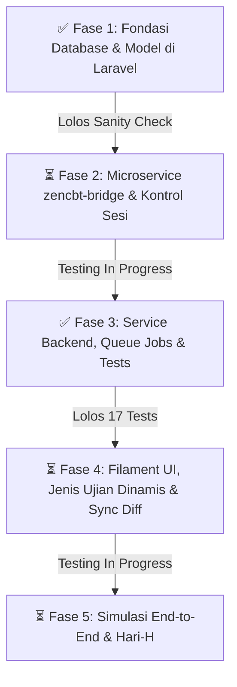

# 📚 Dokumentasi & Analisis Lengkap: Integrasi ZenCBT & Modul Nilai (Khusus SMP)

Repositori dokumentasi teknis dan operasional untuk mengintegrasikan sistem **Absensi & Akademik Sekolah (Laravel 11 + MySQL)** dengan **ZenCBT v1.4.0 (Go Binary + PostgreSQL)**.

---

## 🎯 2 Keputusan Kunci Arsitektur yang Disepakati:

1. **Tahun Ajaran Disimpan di Tabel `programs` ZenCBT**:
   * Karena jenjang SMP tidak memiliki peminatan/jurusan (seperti IPA/IPS di SMA), tabel `programs` dialihfungsikan untuk menampung **Tahun Ajaran** (misal: `code: "2025-2026"`, `nama: "Tahun Ajaran 2025/2026"`).
   * Kolom `mapel.program_id` diset `NULL` agar mata pelajaran bersifat universal dan tidak perlu dibuat ulang tiap tahun.
2. **Kategori Asesmen (UH / ASTS / ASAS) Menggunakan `ujian.event_nama`**:
   * Menghindari duplikasi mata pelajaran di ZenCBT.
   * Siswa dan proktor dapat melihat pengelompokan jadwal tes dengan rapi di layar ZenCBT (contoh: *"ASTS Ganjil 2025/2026"*, *"ASAS Genap 2025/2026"*, *"UH - Aljabar"*).
   * Di Laravel Absensi, event ini otomatis dipetakan ke kolom `jenis_ujian` (`harian`, `sts`, `sas`, `tryout`).
3. **Prinsip Single Student Lifetime & Kenaikan Kelas via UPSERT (Anti-Duplikasi)**:
   * Kolom `siswa.siswa_id` (NISN) di ZenCBT bersifat `UNIQUE NOT NULL`.
   * Data siswa **tidak akan pernah ganda/duplikat** antar tahun ajaran. Siswa yang naik kelas (misal dari 7A ke 8A) otomatis di-*update* rombel dan tahun ajarannya via perintah `ON CONFLICT (siswa_id) DO UPDATE`.
   * Riwayat nilai ujian yang pernah ditempuh siswa pada kelas sebelumnya **tetap aman dan tidak hilang**.
4. **Isolasi Penuh Database ERP (Tabel `students` 0% Disentuh)**:
   * Mengikuti pola bawaan ERP Anda (`StudentPresensiProfile`), kebutuhan data pendukung CBT diisolasi ke tabel pendamping baru: **`student_cbt_profiles`**.
   * Tabel utama `students` **tidak diubah sama sekali**, sehingga modul Presensi Barcode, Login Portal Siswa, SPIKAP, Guru Wali, dan BK dijamin **100% aman tanpa risiko *side-effect***.

---

## 📑 Daftar Berkas Dokumentasi (.md)

Silakan membaca berkas-berkas berikut sesuai urutan:

| No | File Dokumen | Deskripsi & Konten Utama |
| :---: | :--- | :--- |
| **01** | [**`01-arsitektur-dan-alur-sistem.md`**](./01-arsitektur-dan-alur-sistem.md) | Arsitektur *Dual-Mode* (Direct Database vs REST API Bridge), diagram alur data *Push* & *Pull*, dan mitigasi keamanan (jaringan LAN vs VPS). |
| **02** | [**`02-analisa-database-absensi-eksisting.md`**](./02-analisa-database-absensi-eksisting.md) | Audit struktur database MySQL di `projek-absensi-barcode` dan identifikasi 5 kekurangan utama (Semester, Master Ujian, Nilai Siswa, Password Kartu CBT, Sesi). |
| **03** | [**`03-analisa-skema-zencbt.md`**](./03-analisa-skema-zencbt.md) | Analisis menyeluruh 20 tabel internal PostgreSQL ZenCBT (`levels`, `groups`, `siswa`, `ujian`, `peserta_ujian`, `jawaban_ujian`, dll). |
| **04** | [**`04-desain-perbaikan-database-absensi.md`**](./04-desain-perbaikan-database-absensi.md) | **Blueprint Solusi Database**: Rancangan tabel baru (`ujian_akademiks`, `nilai_ujians`, `ujian_akademik_classes`) dan kolom baru (`active_semester`, `cbt_password`, `cbt_sesi`) lengkap dengan kode migrasi Laravel & Model Eloquent. |
| **05** | [**`05-pemetaan-dan-spesifikasi-api-bridge.md`**](./05-pemetaan-dan-spesifikasi-api-bridge.md) | Pemetaan kolom MySQL ➡️ PostgreSQL, format penamaan event asesmen, serta spesifikasi lengkap endpoint REST API Bridge (`/sync/master`, `/sync/students`, `/exams/{id}/results`, `/reset-session`). |
| **06** | [**`06-skenario-implementasi-dan-sop-smp.md`**](./06-skenario-implementasi-dan-sop-smp.md) | **SOP Operasional 4 Tahap di SMP**: Awal Tahun Ajaran, Menjelang Ujian & Cetak Kartu, Pelaksanaan Ujian (CBT), dan Pasca Ujian (Penarikan Nilai & Rapor). |
| **07** | [**`07-analisis-kekurangan-laravel-dan-rencana-eksekusi.md`**](./07-analisis-kekurangan-laravel-dan-rencana-eksekusi.md) | **Checklist Kekurangan Riil di Laravel**: Evaluasi alur bolak-balik, daftar tabel & kolom yang belum ada di Laravel, serta rencana eksekusi teknis. |
| **08** | [**`08-fase-implementasi-dan-checklist-keamanan.md`**](./08-fase-implementasi-dan-checklist-keamanan.md) | **Rencana Fase & Checklist Keamanan (Step-by-Step)**: Panduan eksekusi bertahap (5 Fase), prosedur pengecekan (*sanity check*), kriteria lolos uji, dan rencana *rollback*. |

---

## 🗺️ Roadmap & Status 5 Fase Implementasi

### Ringkasan Status Terkini

| Fase | Fokus Pekerjaan | Status | Catatan Verifikasi |
| :---: | :--- | :---: | :--- |
| **Fase 1** | Migrasi MySQL, Model Eloquent & Profile Pattern Siswa | ✅ **SELESAI** | 6 migrasi sukses, tabel `students` 0% disentuh, auto-KKM teruji, relasi dua arah aktif. |
| **Fase 2** | Microservice `zencbt-bridge` (Slim 4 + PostgreSQL) | ⏳ **DALAM PROSES TESTING** | Penambahan endpoint `GET /api/v1/exams` (daftar ujian), `POST /api/v1/students/{id}/reset-session` & `set-session` dengan audit trail. Sedang proses testing integrasi. |
| **Fase 3** | Service Client, Queue Jobs, Artisan Commands, & Automated Tests | ✅ **SELESAI** | 17 tests passed (43 assertions), live ping HTTP 200/healthy terverifikasi (latency 13ms). |
| **Fase 4** | Filament UI (JenisUjianResource, Sinkron Nilai CBT, Diff Preview Jadwal) & Cetak Kartu | ⏳ **DALAM PROSES TESTING** | Refaktor tabel master `jenis_ujians` & `JenisUjianResource`, penyesuaian `UjianAkademikResource` ("Sinkron Nilai CBT"), modal preview diff jadwal (`sync-exams-preview.blade.php`), penyesuaian automated test suite. |
| **Fase 5** | Simulasi End-to-End Siswa Login, Ujian, & Tarik Nilai Rapor | ⏳ **SIAP DIUJI COBA** | Menunggu penyelesaian testing integrasi Fase 2 & Fase 4. |

