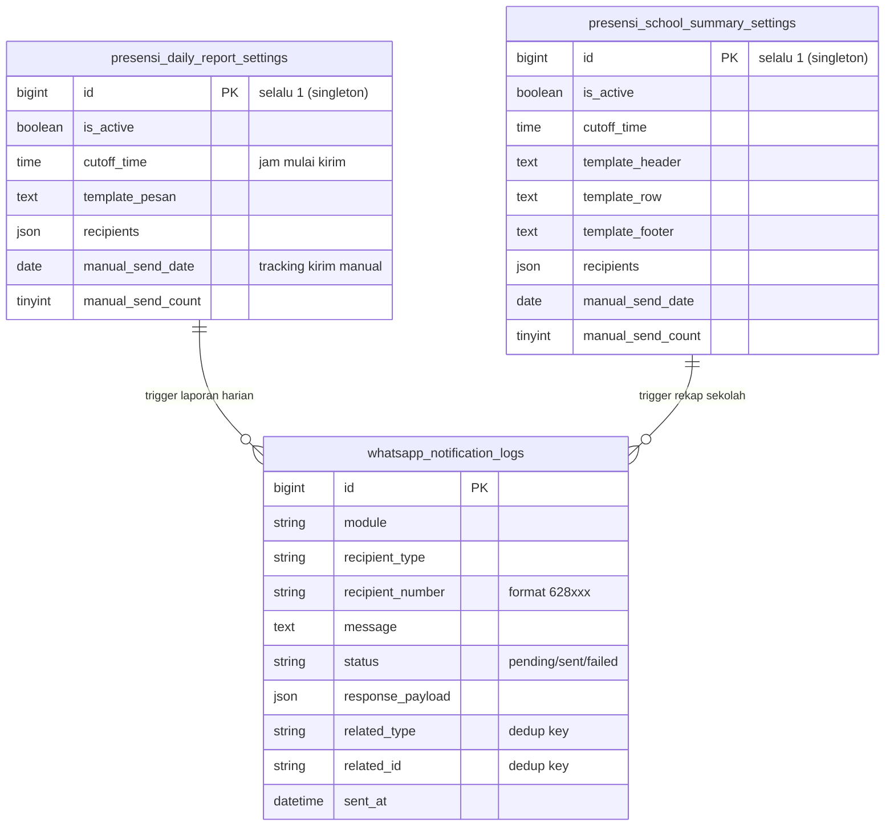

# Panduan Sistem Notifikasi WhatsApp — Laporan Harian & Rekap Sekolah

Dokumen ini menjelaskan cara kerja, cara konfigurasi, cara troubleshooting, dan arsitektur teknis fitur **Laporan Harian Kelas** dan **Rekap Seluruh Sekolah** via WhatsApp.

---

## 📋 Daftar Isi

1. [Gambaran Umum](#gambaran-umum)
2. [Prasyarat](#prasyarat)
3. [Setup Pertama Kali](#setup-pertama-kali)
4. [Cara Mengatur di Admin Panel](#cara-mengatur-di-admin-panel)
5. [Kirim Manual](#kirim-manual)
6. [Status Scheduler di UI](#status-scheduler-di-ui)
7. [Arsitektur Teknis](#arsitektur-teknis)
8. [Troubleshooting](#troubleshooting)
9. [Skema Database](#skema-database)

---

## Gambaran Umum

Sistem ini secara otomatis mengirim laporan presensi harian via WhatsApp sesuai jadwal yang dikonfigurasi admin. Ada dua jenis laporan:

| Jenis | Penerima Tipikal | Isi |
|-------|-----------------|-----|
| **Laporan Harian Kelas** | Wali Kelas tiap kelas | Rekap kehadiran per kelas + daftar siswa belum presensi |
| **Rekap Seluruh Sekolah** | Kepala Sekolah / Operator | Ringkasan kehadiran semua kelas dalam 1 pesan |

Kedua laporan dikirim **sekali per hari** secara otomatis pada jam yang ditentukan, dengan toleransi **1 jam** setelah jam cutoff.

---

## Prasyarat

Sebelum fitur ini bisa berjalan, pastikan semua komponen berikut sudah aktif:

| Komponen | Fungsi | Cara Cek |
|----------|--------|----------|
| **Laravel Scheduler (Cron)** | Memicu command laporan setiap menit | Banner di halaman Manajemen Notifikasi WA |
| **Queue Worker** | Memproses pengiriman WA ke antrian | `ps aux \| grep queue:work` |
| **Evolution API** | Gateway pengirim pesan WA | Cek status instance di Evolution Manager |
| **WhatsApp Bot Terhubung** | Instance WA tidak terlogout | Lihat status di Evolution Manager |

---

## Setup Pertama Kali

### Langkah 1 — Pasang Cron Job di Server

Cron job adalah **komponen wajib** yang sering terlupakan. Tanpa ini, laporan otomatis tidak akan pernah berjalan.

#### Via HestiaCP (Cara yang Digunakan)

1. Login ke HestiaCP → gunakan akun **user aplikasi** (`smpn3kedungreja`), bukan akun `admin`

   > ⚠️ **Penting:** Cron harus dipasang di akun user yang sama dengan kepemilikan file Laravel. Jika dipasang di akun admin, cron tidak akan bisa menulis ke folder `storage/` dan akan gagal diam-diam.

2. Klik menu **CRON** di navbar atas
3. Klik tombol **ADD CRON JOB**
4. Isi form seperti ini:

   | Field | Nilai |
   |-------|-------|
   | Minute | `*` |
   | Hour | `*` |
   | Day | `*` |
   | Month | `*` |
   | Day of Week | `*` |
   | Command | `/usr/bin/php8.3 /home/smpn3kedungreja/web/app.smpn3kedungreja.sch.id/public_html/artisan schedule:run >> /dev/null 2>&1` |

5. Klik **Save**
6. Tunggu 1-2 menit, lalu refresh halaman **Manajemen Notifikasi WA** — banner harus berubah menjadi 🟢 Aktif

#### Via SSH (Alternatif)

```bash
crontab -e
# Tambahkan baris ini:
* * * * * /usr/bin/php8.3 /home/smpn3kedungreja/web/app.smpn3kedungreja.sch.id/public_html/artisan schedule:run >> /dev/null 2>&1
```

### Langkah 2 — Pastikan Queue Worker Berjalan

Queue worker dikelola oleh **Supervisor** (atau PM2). Cek status:

```bash
# Cek apakah queue worker berjalan
ps aux | grep queue:work

# Jika tidak ada, jalankan via Supervisor:
supervisorctl start absensi-queue

# Atau via PM2:
pm2 start ecosystem.config.cjs
```

### Langkah 3 — Hubungkan WhatsApp Bot

1. Buka **Evolution Manager** (sesuai konfigurasi di `.env`)
2. Pilih instance `HaflaITSolution` (atau nama instance yang dikonfigurasi)
3. Scan QR code dengan HP yang akan menjadi bot pengirim WA
4. Tunggu status menjadi **Connected**

> ⚠️ Jika bot terlogout, semua pengiriman akan `failed` dengan error `Connection Closed`. Scan ulang QR code jika terjadi ini.

---

## Cara Mengatur di Admin Panel

Buka: **Admin Presensi → Pengaturan → Manajemen Notifikasi WA**

URL: `https://app.smpn3kedungreja.sch.id/admin-presensi/manajemen-notifikasi-wa`

### Tab: Laporan Harian Kelas

| Pengaturan | Keterangan |
|-----------|------------|
| **Aktifkan Laporan Harian** | Toggle ON/OFF seluruh fitur laporan harian |
| **Jam Pengiriman (Cutoff)** | Jam mulai pengiriman. Laporan dikirim dalam window **cutoff sampai cutoff+1 jam** |
| **Kirim Ke (Penerima)** | Pilih: `Wali Kelas` dan/atau jabatan tertentu. Jabatan "Orang Tua" **tidak tersedia** di sini karena laporan ini untuk internal sekolah |
| **Template Pesan** | Teks pesan yang dikirim. Placeholder otomatis diisi oleh sistem |

**Placeholder tersedia untuk Laporan Harian:**
```
{nama_kelas}           → Nama kelas (contoh: 7A)
{tanggal}              → Tanggal hari ini (dd-mm-yyyy)
{total_siswa}          → Jumlah total siswa di kelas
{jumlah_hadir}         → Jumlah hadir (termasuk terlambat)
{jumlah_terlambat}     → Jumlah terlambat
{jumlah_alpa}          → Jumlah alpa/tanpa keterangan
{jumlah_sakit}         → Jumlah sakit
{jumlah_izin}          → Jumlah izin
{daftar_belum_presensi}→ Nama-nama siswa yang belum absen sama sekali
```

### Tab: Rekap Seluruh Sekolah

| Pengaturan | Keterangan |
|-----------|------------|
| **Aktifkan Laporan Rekap Sekolah** | Toggle ON/OFF seluruh fitur rekap |
| **Jam Pengiriman (Cutoff)** | Sama seperti laporan harian, toleransi 1 jam |
| **Kirim Ke (Penerima)** | Hanya pilihan jabatan (Kepala Sekolah, Operator, dll). Wali Kelas tidak tersedia karena ini laporan helicopter view |
| **Template Header** | Teks di bagian atas pesan. Tampil sekali |
| **Template Baris per Kelas** | Teks yang diulang untuk setiap kelas |
| **Template Footer** | Teks di bagian bawah pesan. Tampil sekali |

**Placeholder tersedia untuk Rekap Sekolah:**
```
Header/Footer:
{nama_sekolah}          → Nama sekolah dari Pengaturan Sekolah
{hari}                  → Nama hari dalam Bahasa Indonesia
{tanggal}               → Tanggal hari ini

Per baris kelas:
{nama_kelas}            → Nama kelas
{jumlah_hadir}          → Jumlah hadir
{jumlah_terlambat}      → Jumlah terlambat
{nama_terlambat}        → Nama siswa terlambat (dalam kurung)
{jumlah_sakit}          → Jumlah sakit
{nama_sakit}            → Nama siswa sakit
{jumlah_izin}           → Jumlah izin
{nama_izin}             → Nama siswa izin
{jumlah_alpa}           → Jumlah alpa
{nama_alpa}             → Nama siswa alpa
{jumlah_belum_presensi} → Jumlah belum absen
{nama_belum_presensi}   → Nama siswa belum absen
```

---

## Kirim Manual

Setiap tab laporan (Laporan Harian Kelas dan Rekap Seluruh Sekolah) memiliki tombol **Kirim Manual** di bagian bawah section.

### Aturan Kirim Manual

- **Maksimal 1x per hari** per jenis laporan
- Setelah digunakan, tombol otomatis di-disable sampai hari berikutnya
- Tidak perlu menunggu jam cutoff — bisa dikirim kapan saja
- Jika laporan hari ini sudah terkirim otomatis, masih bisa kirim manual 1x (override)
- Jika laporan hari ini gagal (`failed`) karena WA bot terputus, kirim manual bisa digunakan setelah bot terhubung kembali

### Cara Pakai

1. Buka tab yang diinginkan (Laporan Harian atau Rekap Sekolah)
2. Scroll ke bawah ke section **Kirim Manual**
3. Klik tombol **📤 Kirim Laporan Sekarang**
4. Muncul dialog konfirmasi → klik **OK**
5. Sistem akan dispatch job ke queue
6. WA akan diterima dalam beberapa detik setelah queue worker memprosesnya

---

## Status Scheduler di UI

Di bagian paling atas halaman Manajemen Notifikasi WA, terdapat **banner status scheduler** yang menunjukkan apakah sistem berjalan dengan benar.

### 🟢 Scheduler Aktif

```
🟢 Scheduler Aktif
Terakhir berjalan: 10:41:02, 11 Aug 2026 (baru saja)
✅ Laporan otomatis akan dikirim sesuai jadwal.
```

Artinya cron job berjalan normal. Sistem akan mengirim laporan otomatis sesuai jam cutoff.

### 🔴 Scheduler Tidak Terdeteksi

```
🔴 Scheduler Tidak Terdeteksi
Belum ada aktivitas scheduler terdeteksi
⚠️ Laporan otomatis TIDAK akan berjalan

📋 Panduan Mengaktifkan Scheduler (HestiaCP)
[panduan langkah demi langkah...]
[▶ Test Jalankan Sekarang]
```

Artinya cron job **belum dipasang** atau berjalan di **user yang salah**. Ikuti panduan di dalam banner.

### Cara Kerja Deteksi

Sistem menggunakan file **heartbeat** di `storage/framework/schedule-heartbeat`. File ini berisi Unix timestamp yang diperbarui **setiap menit** oleh cron. Jika timestamp lebih dari 10 menit yang lalu (atau file tidak ada), status menjadi merah.

---

## Arsitektur Teknis

### Alur Pengiriman Otomatis

```
[Cron: setiap menit]
        ↓
php artisan schedule:run
        ↓
    ┌───────────────────────────────────────┐
    │ scheduler:heartbeat          (~0.4s)  │  → update storage/framework/schedule-heartbeat
    │ presensi:send-daily-class-report      │  → cek cutoff window → dispatch ke queue
    │ presensi:send-school-summary          │  → cek cutoff window → dispatch ke queue
    └───────────────────────────────────────┘
        ↓
[Queue Worker — berjalan terus via Supervisor/PM2]
        ↓
SendWhatsAppNotificationJob::handle()
        ↓
WhatsAppGatewayService::sendMessage()
        ↓
Evolution API → WhatsApp penerima
```

### Logika Cutoff & Window 1 Jam

```php
// Contoh: cutoff_time = '08:30:00'
// Window kirim: 08:30 - 09:30

$cutoffToday    = Carbon::today()->setTimeFromTimeString('08:30');
$windowEndToday = $cutoffToday->copy()->addHour(); // 09:30

if ($now->between($cutoffToday, $windowEndToday)) {
    // Kirim laporan
}
```

**Mengapa toleransi 1 jam?** Cron bisa terlambat beberapa detik karena load server, jam OS tidak presisi, atau restart. Toleransi 1 jam memastikan laporan tetap terkirim meskipun ada sedikit delay.

### Deduplication Guard

Sistem mencegah pengiriman ganda dalam hari yang sama:

```php
// Sebelum dispatch, cek apakah sudah ada log 'sent' atau 'pending' hari ini
$alreadyDispatched = WhatsAppNotificationLog::where('related_type', $relatedType)
    ->where('related_id', $relatedId)
    ->whereDate('created_at', today())
    ->whereIn('status', ['sent', 'pending'])  // 'failed' tidak diblok!
    ->exists();
```

> ⚠️ **Penting:** Log berstatus `failed` **tidak** memblok pengiriman ulang. Jadi jika pengiriman gagal karena WA bot terputus, setelah bot dihubungkan kembali, pengiriman akan dicoba ulang otomatis pada menit berikutnya (selama masih dalam window 1 jam) atau via tombol kirim manual.

### File & Class Penting

| File | Fungsi |
|------|--------|
| `routes/console.php` | Registrasi jadwal scheduler |
| `app/Console/Commands/SchedulerHeartbeatCommand.php` | Tulis timestamp heartbeat |
| `app/Console/Commands/SendDailyClassReportCommand.php` | Wrapper command laporan harian |
| `app/Console/Commands/SendSchoolSummaryReportCommand.php` | Wrapper command rekap sekolah |
| `app/Services/DailyClassReportService.php` | Logic dispatch laporan harian (reusable) |
| `app/Services/SchoolSummaryReportService.php` | Logic dispatch rekap sekolah (reusable) |
| `app/Jobs/SendWhatsAppNotificationJob.php` | Queue job kirim WA via Evolution API |
| `app/Filament/Presensi/Pages/ManajemenNotifikasiWaPage.php` | Halaman pengaturan & kirim manual |
| `storage/framework/schedule-heartbeat` | File timestamp heartbeat scheduler |

---

## Troubleshooting

### ❌ WA tidak diterima meskipun sudah waktunya

**Cek berurutan:**

1. **Apakah scheduler aktif?**
   - Lihat banner di halaman Manajemen Notifikasi WA
   - Jika merah: pasang cron job (lihat [Setup Pertama Kali](#setup-pertama-kali))

2. **Apakah queue worker berjalan?**
   ```bash
   ps aux | grep queue:work
   ```
   Jika tidak ada proses: restart via `supervisorctl start absensi-queue` atau `pm2 restart absensi-queue`

3. **Apakah WhatsApp bot terhubung?**
   - Buka Evolution Manager → cek status instance
   - Jika terlogout: scan ulang QR code

4. **Apakah cutoff time sudah lewat lebih dari 1 jam?**
   - Misal cutoff 08:30, kamu cek jam 10:00 → sudah lewat window 09:30
   - Gunakan tombol **Kirim Manual** untuk kirim hari ini

5. **Apakah laporan sudah terkirim hari ini?**
   - Cek di `whatsapp_notification_logs` (via admin atau database)
   - Jika ada record `sent` hari ini → dedup guard aktif, laporan tidak akan dikirim ulang otomatis

### ❌ Banner scheduler merah padahal cron sudah dipasang

- Pastikan cron dipasang di **user yang sama** dengan file Laravel (`smpn3kedungreja`), bukan user `admin`
- Klik tombol **▶ Test Jalankan Sekarang** di banner merah untuk verifikasi manual
- Cek permission file: `ls -la storage/framework/schedule-heartbeat`

### ❌ Error `Connection Closed` di log WA

WhatsApp bot terlogout dari Evolution API. Scan ulang QR code.

### ❌ Nomor tidak menerima WA

Pastikan format nomor di data guru/jabatan menggunakan awalan `628` bukan `08`:
- ❌ Salah: `082227799114`
- ✅ Benar: `6282227799114`

Jika di database masih format `08xxx`, update via menu Manajemen Guru.

---

## Skema Database

### Tabel: `presensi_daily_report_settings` (Singleton id=1)

| Kolom | Tipe | Keterangan |
|-------|------|------------|
| `id` | bigint | Primary key, selalu 1 |
| `is_active` | boolean | Toggle aktif/tidak |
| `cutoff_time` | time | Jam mulai pengiriman (HH:MM:SS) |
| `template_pesan` | text | Template pesan dengan placeholder |
| `recipients` | json | Array key penerima: `["wali_kelas", "Operator"]` |
| `manual_send_date` | date | Tanggal terakhir kirim manual |
| `manual_send_count` | tinyint | Jumlah kirim manual hari ini (reset tiap hari) |

### Tabel: `presensi_school_summary_settings` (Singleton id=1)

| Kolom | Tipe | Keterangan |
|-------|------|------------|
| `id` | bigint | Primary key, selalu 1 |
| `is_active` | boolean | Toggle aktif/tidak |
| `cutoff_time` | time | Jam mulai pengiriman |
| `template_header` | text | Template header pesan |
| `template_row` | text | Template per baris kelas |
| `template_footer` | text | Template footer pesan |
| `recipients` | json | Array key jabatan penerima |
| `manual_send_date` | date | Tanggal terakhir kirim manual |
| `manual_send_count` | tinyint | Jumlah kirim manual hari ini |

### Tabel: `whatsapp_notification_logs`

| Kolom | Tipe | Keterangan |
|-------|------|------------|
| `id` | bigint | Auto increment |
| `module` | string | `presensi` atau `perpustakaan` |
| `recipient_type` | string | `wali_kelas`, `Operator`, `ortu`, dll |
| `recipient_number` | string | Nomor tujuan format `628xxx` |
| `message` | text | Isi pesan yang dikirim |
| `status` | string | `pending` → `sent` / `failed` |
| `response_payload` | json | Response dari Evolution API |
| `related_type` | string | `daily_report_kelas`, `school_summary_report`, dll |
| `related_id` | string | ID entitas terkait (untuk dedup guard) |
| `sent_at` | datetime | Waktu sukses terkirim |

### Relasi Diagram



---

*Dokumentasi ini dibuat pada 11 Agustus 2026 sebagai bagian dari implementasi perbaikan sistem notifikasi WA terjadwal.*
