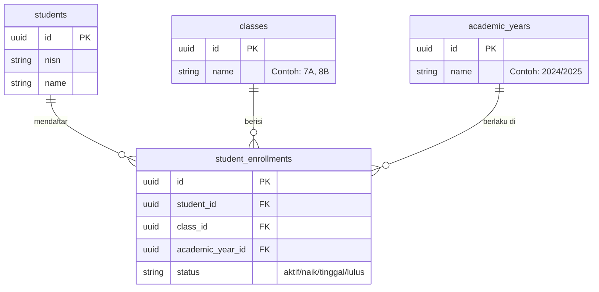
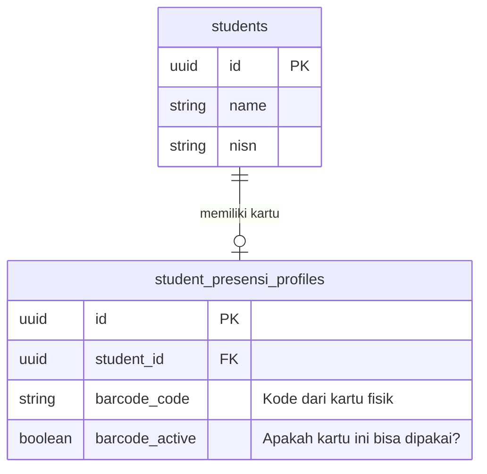
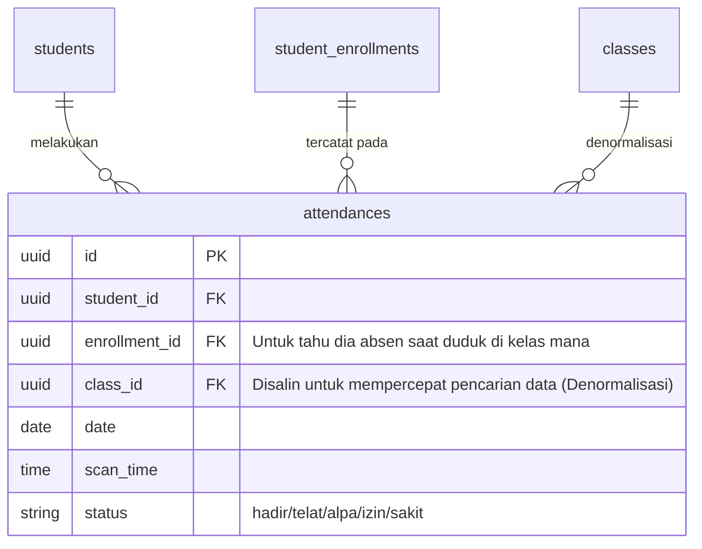

# Penjelasan Relasi Entitas: Siswa, Kelas, dan Absensi

Dokumen ini dibuat untuk memberikan gambaran (*mental model*) yang jelas mengenai bagaimana data Siswa, Kelas, dan Absensi saling terhubung dalam arsitektur ERP aplikasi ini. Pemahaman relasi ini sangat penting karena kita **tidak menyimpan data secara langsung/naif** demi menjaga keutuhan riwayat data dari tahun ke tahun.

---

## 1. Relasi Siswa dengan Kelas (Pendaftaran / Enrollment)

Kesalahan umum dalam membuat aplikasi sekolah sederhana adalah meletakkan kolom `class_id` langsung di dalam tabel `students`. Hal ini akan membuat kita kehilangan riwayat kelas saat siswa naik kelas di tahun berikutnya.

Dalam arsitektur kita, **Siswa tidak berelasi langsung dengan Kelas**. Mereka dihubungkan melalui "jembatan" bernama **Student Enrollments** (Pendaftaran Siswa).

**Alur Cerita:**
Andi (Siswa) masuk di Tahun Ajaran 2024/2025 ke Kelas 7A. Maka kita membuat 1 baris di `student_enrollments`. 
Tahun depan (2025/2026), Andi naik ke Kelas 8A. Kita **TIDAK** menimpa data 7A. Kita membuat **baris baru** di `student_enrollments` untuk Andi dengan kelas 8A. Dengan begini, sejarah/riwayat Andi di 7A tetap utuh selamanya!

---

## 2. Relasi Siswa dengan Kartu Barcode (Presensi Profile)

Sejak *Refactoring* Tahap 2, kita memisahkan data *Master* (Siswa murni) dengan data *Operasional* (Alat presensi). Kita membuat relasi **1-to-1** antara Siswa dan Profil Presensinya.

**Alur Cerita:**
Siswa hanya berisi biodata dan akun *login*. Jika kartu fisik hilang, kita cukup menonaktifkan (*barcode_active = false*) di tabel `student_presensi_profiles` dan membuat kartu baru, **tanpa** mengganggu data inti siswa maupun merusak riwayat absensi sebelumnya.

---

## 3. Relasi Absensi (Kehadiran Harian)

Tabel `attendances` (Absensi) berfungsi mengunci momen kehadiran. Setiap kali scan barcode terjadi, data akan dicatat dan dihubungkan ke Siswa dan Pendaftarannya (`enrollment_id`).

**Alur Cerita:**
Saat siswa scan *barcode*, sistem mencari `barcode_code` di tabel `student_presensi_profiles` untuk mendapatkan `student_id`.
Setelah tahu siapa siswanya, sistem akan mencari `enrollment` (kelas) mana yang aktif untuk siswa tersebut pada Tahun Ajaran saat ini.
Akhirnya, catatan absen dibuat di tabel `attendances`, mengunci info Siswa dan Kelas yang sedang dia duduki pada saat *scan* tersebut.

> [!TIP]
> Mengapa ada `class_id` di dalam `attendances` padahal sudah ada di `student_enrollments`?
> Ini disebut **Denormalisasi**. Tujuannya agar saat kita ingin membuat grafik "Berapa banyak siswa 7A yang hadir hari ini?", sistem tidak perlu repot-repot melakukan *Join* antar tabel yang berat. Kueri akan langsung dieksekusi dengan super cepat karena datanya sudah tersedia di tabel absensi!
