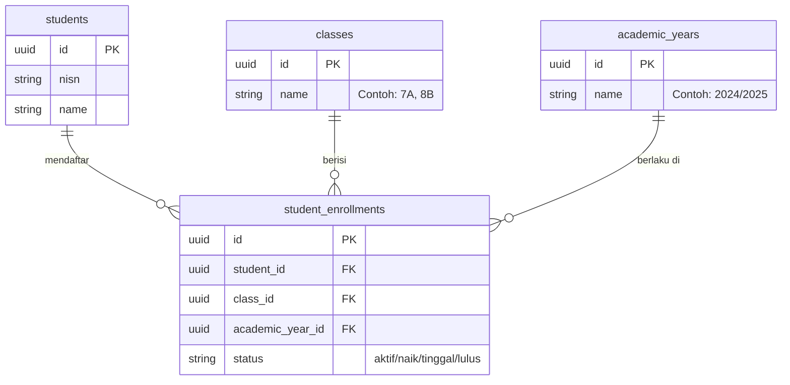
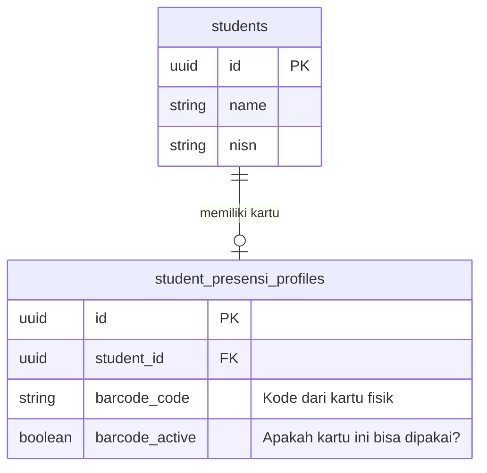
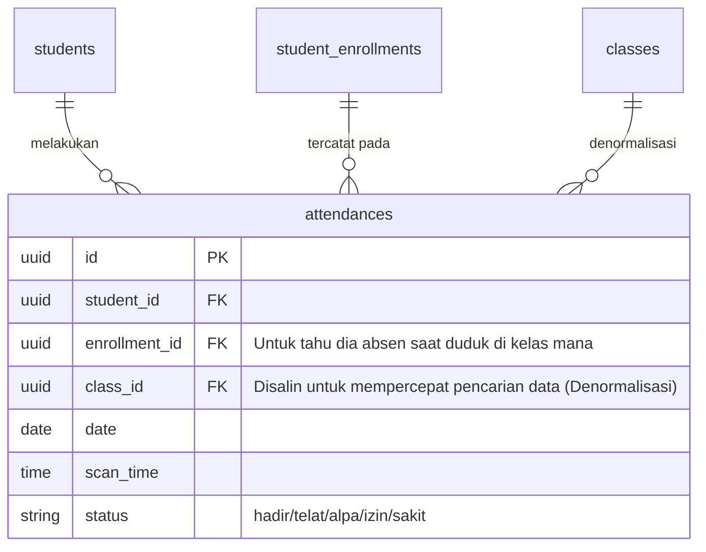
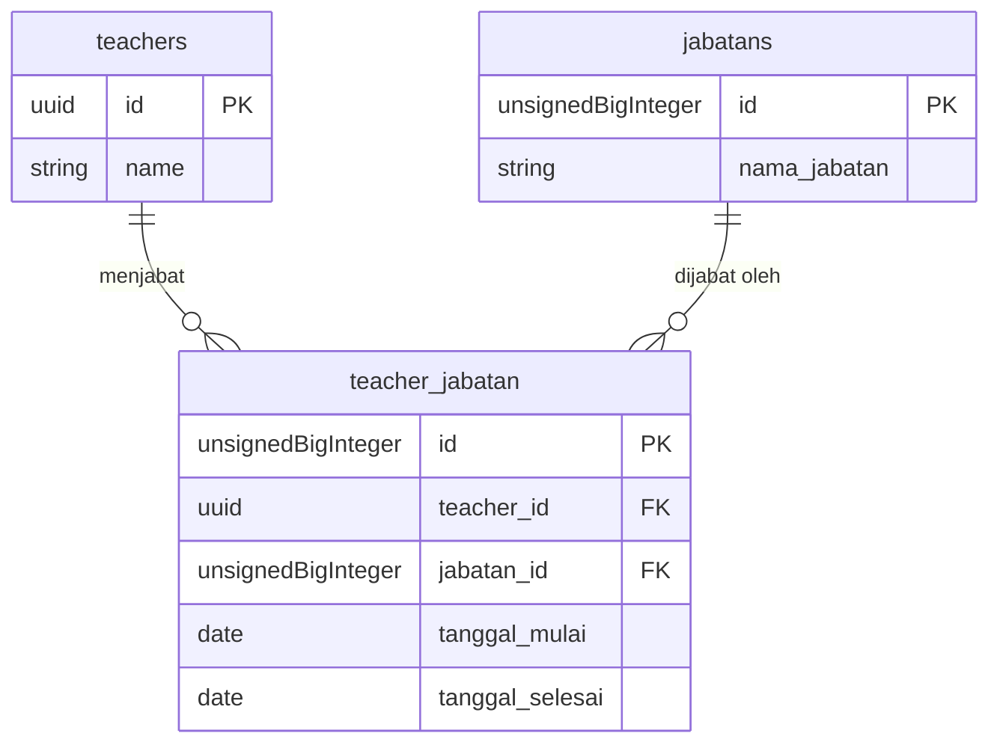
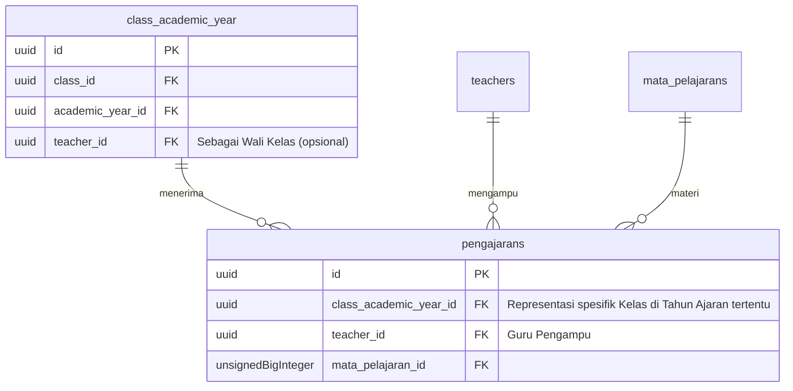
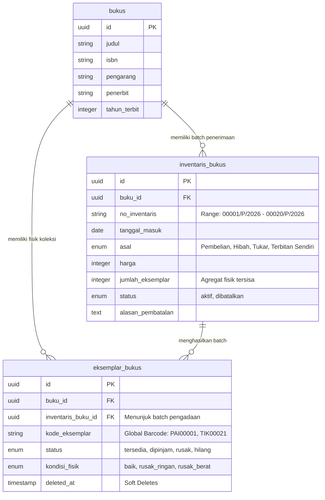
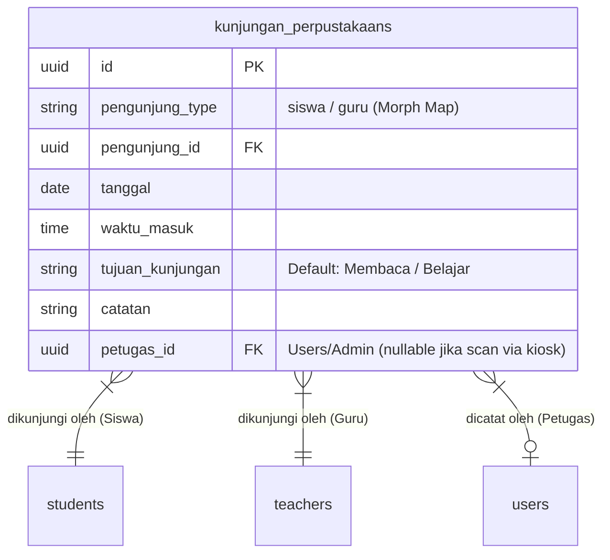

# Penjelasan Relasi Entitas: Siswa, Kelas, dan Absensi

Dokumen ini dibuat untuk memberikan gambaran (*mental model*) yang jelas mengenai bagaimana data Siswa, Kelas, dan Absensi saling terhubung dalam arsitektur ERP aplikasi ini. Pemahaman relasi ini sangat penting karena kita **tidak menyimpan data secara langsung/naif** demi menjaga keutuhan riwayat data dari tahun ke tahun.

---

## 1. Relasi Siswa dengan Kelas (Pendaftaran / Enrollment)

Kesalahan umum dalam membuat aplikasi sekolah sederhana adalah meletakkan kolom `class_id` langsung di dalam tabel `students`. Hal ini akan membuat kita kehilangan riwayat kelas saat siswa naik kelas di tahun berikutnya.

Dalam arsitektur kita, **Siswa tidak berelasi langsung dengan Kelas**. Mereka dihubungkan melalui "jembatan" bernama **Student Enrollments** (Pendaftaran Siswa).

```mermaid
erDiagram
    students ||--o{ student_enrollments : "mendaftar"
    classes ||--o{ student_enrollments : "berisi"
    academic_years ||--o{ student_enrollments : "berlaku di"

    students {
        uuid id PK
        string nisn
        string name
    }
    
    classes {
        uuid id PK
        string name "Contoh: 7A, 8B"
    }

    academic_years {
        uuid id PK
        string name "Contoh: 2024/2025"
    }

    student_enrollments {
        uuid id PK
        uuid student_id FK
        uuid class_id FK
        uuid academic_year_id FK
        string status "aktif/naik/tinggal/lulus"
    }
```

**Alur Cerita:**
Andi (Siswa) masuk di Tahun Ajaran 2024/2025 ke Kelas 7A. Maka kita membuat 1 baris di `student_enrollments`. 
Tahun depan (2025/2026), Andi naik ke Kelas 8A. Kita **TIDAK** menimpa data 7A. Kita membuat **baris baru** di `student_enrollments` untuk Andi dengan kelas 8A. Dengan begini, sejarah/riwayat Andi di 7A tetap utuh selamanya!

---

## 2. Relasi Siswa dengan Kartu Barcode (Presensi Profile)

Sejak *Refactoring* Tahap 2, kita memisahkan data *Master* (Siswa murni) dengan data *Operasional* (Alat presensi). Kita membuat relasi **1-to-1** antara Siswa dan Profil Presensinya.

```mermaid
erDiagram
    students ||--o| student_presensi_profiles : "memiliki kartu"

    students {
        uuid id PK
        string name
        string nisn
    }
    
    student_presensi_profiles {
        uuid id PK
        uuid student_id FK
        string barcode_code "Kode dari kartu fisik"
        boolean barcode_active "Apakah kartu ini bisa dipakai?"
    }
```

**Alur Cerita:**
Siswa hanya berisi biodata dan akun *login*. Jika kartu fisik hilang, kita cukup menonaktifkan (*barcode_active = false*) di tabel `student_presensi_profiles` dan membuat kartu baru, **tanpa** mengganggu data inti siswa maupun merusak riwayat absensi sebelumnya.

---

## 3. Relasi Absensi (Kehadiran Harian)

Tabel `attendances` (Absensi) berfungsi mengunci momen kehadiran. Setiap kali scan barcode terjadi, data akan dicatat dan dihubungkan ke Siswa dan Pendaftarannya (`enrollment_id`).

```mermaid
erDiagram
    students ||--o{ attendances : "melakukan"
    student_enrollments ||--o{ attendances : "tercatat pada"
    classes ||--o{ attendances : "denormalisasi"
    
    attendances {
        uuid id PK
        uuid student_id FK
        uuid enrollment_id FK "Untuk tahu dia absen saat duduk di kelas mana"
        uuid class_id FK "Disalin untuk mempercepat pencarian data (Denormalisasi)"
        date date
        time scan_time
        string status "hadir/telat/alpa/izin/sakit"
    }
```

**Alur Cerita:**
Saat siswa scan *barcode*, sistem mencari `barcode_code` di tabel `student_presensi_profiles` untuk mendapatkan `student_id`.
Setelah tahu siapa siswanya, sistem akan mencari `enrollment` (kelas) mana yang aktif untuk siswa tersebut pada Tahun Ajaran saat ini.
Akhirnya, catatan absen dibuat di tabel `attendances`, mengunci info Siswa dan Kelas yang sedang dia duduki pada saat *scan* tersebut.

> [!TIP]
> Ini disebut **Denormalisasi**. Tujuannya agar saat kita ingin membuat grafik "Berapa banyak siswa 7A yang hadir hari ini?", sistem tidak perlu repot-repot melakukan *Join* antar tabel yang berat. Kueri akan langsung dieksekusi dengan super cepat karena datanya sudah tersedia di tabel absensi!

---

## 4. Relasi Guru dengan Jabatan (Kepegawaian / HRD)

Untuk mengakomodasi fleksibilitas penugasan, seorang Guru (Teacher) dihubungkan ke Jabatan (Position) secara **Banyak-ke-Banyak (Many-to-Many)** melalui tabel pivot `teacher_jabatan`.

```mermaid
erDiagram
    teachers ||--o{ teacher_jabatan : "menjabat"
    jabatans ||--o{ teacher_jabatan : "dijabat oleh"

    teachers {
        uuid id PK
        string name
    }
    
    jabatans {
        unsignedBigInteger id PK
        string nama_jabatan
    }

    teacher_jabatan {
        unsignedBigInteger id PK
        uuid teacher_id FK
        unsignedBigInteger jabatan_id FK
        date tanggal_mulai
        date tanggal_selesai
    }
```

**Alur Cerita:**
Guru Budi dapat merangkap jabatan sebagai "Wali Kelas" sekaligus "Wakil Kepala Sekolah". Kita cukup membuat dua baris di tabel `teacher_jabatan` untuk Budi, menautkannya ke dua ID jabatan berbeda. Hal ini memastikan pelaporan struktural sekolah akurat.

> [!WARNING]
> **Teknis Filament Repeater & BelongsToMany:**
> Meskipun secara konseptual tabel `teacher_jabatan` murni berupa *pivot*, di dalam kode kita membuatkan model Eloquent khusus `App\Models\TeacherJabatan`. 
> Hal ini dilakukan untuk menghindari **bug pada Filament v3 Repeater** (error `Field 'nama_jabatan' doesn't have a default value`). Dengan menggunakan relasi `HasMany` ke model perantara (`teacherJabatans()`), Filament dapat menambah/menghapus baris *pivot* beserta data tambahannya (`tanggal_mulai`, `tanggal_selesai`) dengan aman tanpa mencoba membuat *Master Jabatan* baru secara tidak sengaja.

---

## 5. Relasi Guru dengan Mata Pelajaran & Kelas (Pengajaran / Jadwal)

Di Modul Akademik ERP, kita memetakan **Siapa (Guru) mengajarkan Apa (Mata Pelajaran) di mana (Kelas) dan kapan (Tahun Ajaran)**. Relasi kompleks ini dijembatani oleh tabel `pengajarans`.

```mermaid
erDiagram
    class_academic_year ||--o{ pengajarans : "menerima"
    teachers ||--o{ pengajarans : "mengampu"
    mata_pelajarans ||--o{ pengajarans : "materi"

    class_academic_year {
        uuid id PK
        uuid class_id FK
        uuid academic_year_id FK
        uuid teacher_id FK "Sebagai Wali Kelas (opsional)"
    }
    
    pengajarans {
        uuid id PK
        uuid class_academic_year_id FK "Representasi spesifik Kelas di Tahun Ajaran tertentu"
        uuid teacher_id FK "Guru Pengampu"
        unsignedBigInteger mata_pelajaran_id FK
    }
```

**Alur Cerita:**
Kita membuat sebuah entri di tabel `pengajarans` yang mengaitkan Guru Ani (Teacher), Matematika (Mata Pelajaran), dan 7A-2025/2026 (`class_academic_year_id`). 
Data ini akan menjadi dasar bagi penyusunan *Jadwal Pelajaran* (Timetable) harian dan sistem penginputan nilai/E-Rapor oleh guru tersebut di masa depan. Konsep ini mirip dengan Pendaftaran (Enrollment) pada Siswa, menjamin riwayat mengajar tidak hilang berganti tahun ajaran.

---

## 6. Relasi Modul Perpustakaan: Buku, Inventaris Buku, dan Eksemplar Buku

Untuk menjamin keakuratan audit pencatatan (*audit trail*), Modul Perpustakaan memisahkan antara **Katalog Buku (Judul)**, **Batch Penerimaan/Pengadaan (Inventaris Buku)**, dan **Fisik Buku yang Bersirkulasi (Eksemplar Buku)**.

```mermaid
erDiagram
    bukus ||--o{ inventaris_bukus : "memiliki batch penerimaan"
    bukus ||--o{ eksemplar_bukus : "memiliki fisik koleksi"
    inventaris_bukus ||--o{ eksemplar_bukus : "menghasilkan batch"

    bukus {
        uuid id PK
        string judul
        string isbn
        string pengarang
        string penerbit
        integer tahun_terbit
    }

    inventaris_bukus {
        uuid id PK
        uuid buku_id FK
        string no_inventaris "Range: 00001/P/2026 - 00020/P/2026"
        date tanggal_masuk
        enum asal "Pembelian, Hibah, Tukar, Terbitan Sendiri"
        integer harga
        integer jumlah_eksemplar "Agregat fisik tersisa"
        enum status "aktif, dibatalkan"
        text alasan_pembatalan
    }

    eksemplar_bukus {
        uuid id PK
        uuid buku_id FK
        uuid inventaris_buku_id FK "Menunjuk batch pengadaan"
        string kode_eksemplar "Global Barcode: PAI00001, TIK00021"
        enum status "tersedia, dipinjam, rusak, hilang"
        enum kondisi_fisik "baik, rusak_ringan, rusak_berat"
        timestamp deleted_at "Soft Deletes"
    }
```

**Alur & Aturan Bisnis:**
1. **Global Sequence Barcode**: Penomoran barcode eksemplar bersifat berurutan secara *global* (`00001`, `00002`, dst.) di seluruh database terlepas dari prefix kategori/mata pelajaran (misal: `PAI00001` - `PAI00020`, dilanjutkan `TIK00021` - `TIK00030`). Penomoran ini dilindungi oleh *Database Transaction* + *Pessimistic Locking* (`lockForUpdate()`).
2. **Otomatisasi Batch Inventaris**: Setiap kali dilakukan penambahan buku baru atau generate eksemplar massal, sistem secara otomatis menyimpan 1 baris ke `inventaris_bukus` (sebagai buku induk audit) dan menautkan ID inventaris tersebut ke seluruh eksemplar fisik yang dibuat (`inventaris_buku_id`).
3. **Audit Trail & Soft Delete**: Panel `InventarisBukuResource` bersifat murni *Read-Only*. Pembatalan penerimaan buku tidak menggunakan perintah `Delete` melainkan Action khusus **"Batalkan Entri"** yang mengubah status menjadi `dibatalkan` dan me-soft-delete eksemplar terkait. Pembatalan akan ditolak jika ada eksemplar yang berstatus tidak 'tersedia' atau pernah memiliki riwayat peminjaman historis.
4. **Event-Driven Agregasi**: Ketika eksemplar fisik dihapus secara individual, Model `EksemplarBuku` secara otomatis mengurangi (*decrement*) kolom `jumlah_eksemplar` pada baris `inventaris_bukus` induknya lewat Eloquent Event.

---

## 7. Relasi Modul Perpustakaan: Presensi & Kunjungan Perpustakaan

Untuk mencatat kehadiran dan tingkat kunjungan anggota (Siswa maupun Guru) ke perpustakaan secara independen dari sirkulasi buku, sistem menyediakan tabel polymorphic `kunjungan_perpustakaans`.

```mermaid
erDiagram
    kunjungan_perpustakaans }|--|| students : "dikunjungi oleh (Siswa)"
    kunjungan_perpustakaans }|--|| teachers : "dikunjungi oleh (Guru)"
    kunjungan_perpustakaans }|--o| users : "dicatat oleh (Petugas)"

    kunjungan_perpustakaans {
        uuid id PK
        string pengunjung_type "siswa / guru (Morph Map)"
        uuid pengunjung_id FK
        date tanggal
        time waktu_masuk
        string tujuan_kunjungan "Default: Membaca / Belajar"
        string catatan
        uuid petugas_id FK "Users/Admin (nullable jika scan via kiosk)"
    }
```

**Alur & Aturan Bisnis:**
1. **Dukungan Dual-Scanner Kiosk**: Halaman Kiosk Presensi Kunjungan (`/perpustakaan/kunjungan`) menerima pemindaian fisik Hardware Barcode Reader maupun Kamera Web/HP.
2. **Fleksibilitas Identitas Kartu**: Kiosk secara otomatis mencari kecocokan dari `barcode_code` (Student/Teacher Presensi Profile), `NISN`, `NIS`, maupun `NIP`.
3. **Proteksi Anti Spam (Debounce)**: Sistem secara otomatis menolak pencatatan berulang untuk pengunjung yang sama jika baru saja mencatat kunjungan dalam interval 3 menit di hari yang sama.
4. **Integrasi Admin Panel**: Petugas perpustakaan dapat memantau riwayat presensi kunjungan secara real-time via `/admin-perpustakaan/riwayat-presensi` lengkap dengan filter tanggal dan kelas.

---

## 8. Relasi Modul Notifikasi WhatsApp (Evolution API)

Untuk mengirimkan notifikasi absensi (hadir, telat, dsb) maupun pengingat perpustakaan secara *real-time* atau terjadwal, sistem dilengkapi dengan **WhatsApp Gateway Service**.

```mermaid
erDiagram
    whatsapp_settings ||--o{ whatsapp_notification_logs : "pusat konfigurasi API"
    presensi_notification_settings ||--o{ whatsapp_notification_logs : "trigger notif per siswa"
    presensi_daily_report_settings ||--o{ whatsapp_notification_logs : "trigger rekap per kelas"
    presensi_school_summary_settings ||--o{ whatsapp_notification_logs : "trigger rekap 1 sekolah"

    whatsapp_settings {
        id PK
        string base_url
        string api_key
        string instance_name
        time send_window_start
        time send_window_end
    }

    whatsapp_notification_logs {
        id PK
        string module "presensi / perpustakaan"
        string recipient_number
        string status "pending / sent / failed"
        string related_type "Polymorphic marker"
        string related_id
    }
```

**Alur & Aturan Bisnis:**
1. **Singleton Configuration**: Konfigurasi koneksi WA (`whatsapp_settings`), rekap kelas (`presensi_daily_report_settings`), dan rekap sekolah (`presensi_school_summary_settings`) murni berdesain *Singleton* (selalu id=1). Hanya ada 1 nomor bot untuk seluruh ERP.
2. **Deduplication Guard**: Sebelum *Job Queue* melempar HTTP request ke Evolution API, sistem menciptakan baris log berstatus `pending` di `whatsapp_notification_logs` dengan menautkan `related_type` (misal: "presensi_telat") dan `related_id` (misal: ID Absensi siswa). Jika *Event Observer* terpanggil 2 kali untuk data yang sama, *guard* ini akan menggagalkan *dispatch* berulang, menghindari *spam* WA ganda.
3. **Recipient Resolver**: *Service layer* (`RecipientResolverService`) bertugas menerjemahkan tujuan "Orang Tua", "Wali Kelas", atau "Kepala Sekolah" menjadi deretan angka 628xxx secara dinamis lewat query *Eloquent* ke Master Data (Siswa, Kelas, Jabatan).
4. **Scheduler (Cron)**: Khusus untuk *Daily Report* (Laporan per Kelas) dan *School Summary* (Rekap Helikopter 1 Sekolah), Command berjalan setiap menit mengecek kecocokan dengan `cutoff_time` sebelum merangkum dan mengeksekusi pengiriman.
