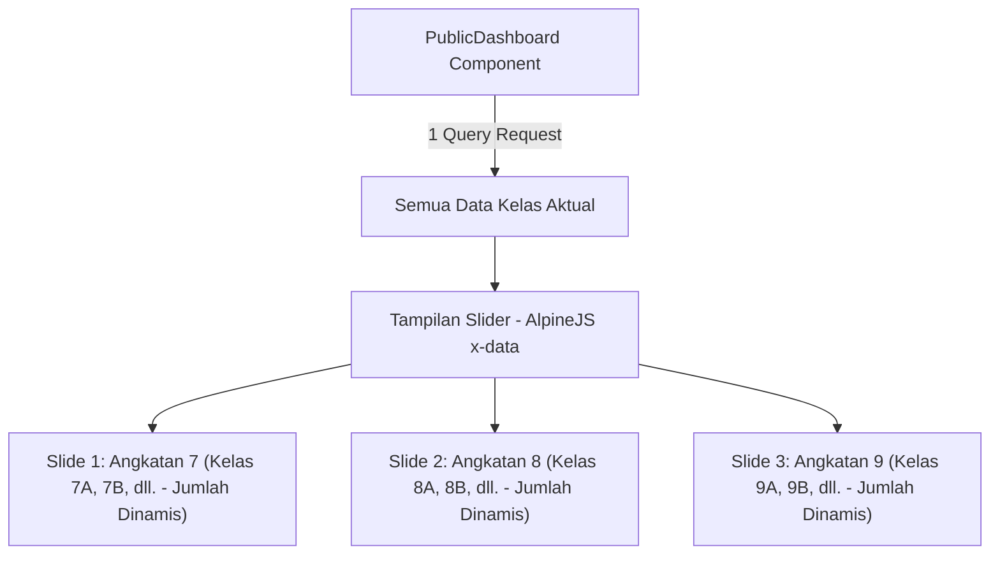

# TAHAP 5 - IMPLEMENTATION PLAN: Dashboard Publik (REVISI #6)

## 1. Ringkasan Scope
Implementasi Dashboard Publik untuk satu sekolah (single-school) yang menyajikan data agregasi tingkat kehadiran per kelas tanpa memaparkan identitas/nama siswa secara individu. Fitur ini menyediakan dua mode tampilan: Mode Publik (`/`) dengan panel filter dan navigasi manual yang ramah mobile, serta Mode TV/Kios (`/display`) fullscreen tanpa filter yang melakukan loop otomatis antar slide angkatan tiap 8 detik.

---

## 2. Konfirmasi & Investigasi Skema Database Aktual

### a. Verifikasi Kolom Angkatan/Tingkat di Tabel `classes`
Berdasarkan berkas migrasi aktual `database/migrations/2026_07_01_144309_create_classes_table.php` dan skema form Filament `app/Filament/Resources/Kelas/Schemas/KelasForm.php`:
- **Nama Kolom Aktual**: **`grade_level`** (bertipe `tinyInteger`), bukan `tingkat`.
- **Label UI**: Di panel admin Filament, kolom ini diberi label **"Tingkat"** dengan opsi nilai integer `7` (Kelas 7 SMP), `8` (Kelas 8 SMP), dan `9` (Kelas 9 SMP).
- **Implikasi**: Pada query SQL dan Eloquent, kita wajib menggunakan nama kolom asli **`grade_level`**.

### b. File Migration Lengkap

Berikut adalah isi berkas migrasi lengkap untuk tabel pencatatan absensi harian (`attendances`) dan log scan mentah (`scan_logs`):

#### 1. Tabel Absensi Harian (`attendances` - dari `database/migrations/2026_07_01_144517_create_attendances_table.php`)
```php
<?php

use Illuminate\Database\Migrations\Migration;
use Illuminate\Database\Schema\Blueprint;
use Illuminate\Support\Facades\Schema;

return new class extends Migration
{
    public function up(): void
    {
        Schema::create('attendances', function (Blueprint $table) {
            $table->uuid('id')->primary();
            $table->foreignUuid('student_id')->constrained('students');
            $table->foreignUuid('enrollment_id')->constrained('student_enrollments');

            // DENORMALIZED — disalin dari enrollment saat insert untuk mempercepat query dashboard
            $table->foreignUuid('class_id')->constrained('classes');
            $table->foreignUuid('academic_year_id')->constrained('academic_years');

            $table->date('date');
            $table->time('scan_time')->nullable();
            $table->enum('status', ['hadir', 'telat', 'alpa', 'sakit', 'izin']);
            $table->unsignedInteger('late_minutes')->default(0);
            $table->string('note')->nullable(); // alasan Izin/Sakit dari wali kelas

            $table->boolean('is_manual_input')->default(false);
            // Polymorphic: bisa Teacher (wali_kelas) atau User (admin)
            $table->uuid('manual_input_by_id')->nullable();
            $table->string('manual_input_by_type')->nullable();

            // Admin yang scan (guard Filament = tabel users)
            $table->foreignUuid('scanned_by')->nullable()->constrained('users')->nullOnDelete();

            $table->timestamps();

            // Satu siswa hanya 1 record per hari
            $table->unique(['student_id', 'date']);
            // Index untuk query dashboard tanpa join berlapis
            $table->index(['class_id', 'academic_year_id', 'date']);
        });
    }

    public function down(): void
    {
        Schema::dropIfExists('attendances');
    }
};
```

#### 2. Tabel Log Scan (`scan_logs` - dari `database/migrations/2026_07_02_162927_rename_invalid_scan_logs_to_scan_logs.php`)
```php
<?php

use Illuminate\Database\Migrations\Migration;
use Illuminate\Database\Schema\Blueprint;
use Illuminate\Support\Facades\Schema;

return new class extends Migration
{
    /**
     * Run the migrations.
     */
    public function up(): void
    {
        Schema::dropIfExists('invalid_scan_logs');

        Schema::create('scan_logs', function (Blueprint $table) {
            $table->uuid('id')->primary();
            $table->string('barcode_code')->nullable();
            $table->foreignUuid('student_id')->nullable()->constrained('students')->nullOnDelete();
            $table->string('status');
            $table->dateTime('scan_time');
            $table->string('ip_address')->nullable();
            $table->timestamps();
        });
    }

    /**
     * Reverse the migrations.
     */
    public function down(): void
    {
        Schema::dropIfExists('scan_logs');

        Schema::create('invalid_scan_logs', function (Blueprint $table) {
            $table->uuid('id')->primary();
            $table->string('scanned_code');
            $table->dateTime('scan_time');
            $table->string('ip_address')->nullable();
            $table->timestamps();
        });
    }
};
```

> **Keputusan Penggunaan Tabel**: 
> - **`attendances`** digunakan untuk seluruh query agregasi dashboard karena menyimpan data status terstruktur (`hadir`, `telat`, `alpa`, `sakit`, `izin`) serta denormalisasi kolom `class_id` dan `academic_year_id`.
> - **`scan_logs`** hanya digunakan sebagai audit log mentah scan kartu barcode dan tidak dibaca dalam kalkulasi statistik dashboard publik.

---

### c. Formula Pasti "Jam Tutup Absensi"
Jam tutup absensi (closing window) didefinisikan dengan satu formula pasti:
$$\text{Jam Tutup Absensi} = \text{checkin\_time} + 60\text{ menit}$$
*Contoh*: Jika `checkin_time` di `school_settings` bernilai `'07:00:00'`, maka Jam Tutup Absensi adalah tepat pukul `'08:00:00'`.
Di backend Laravel, formula ini dihitung menggunakan Carbon:
```php
$closingTime = \Carbon\Carbon::parse($settings->checkin_time)->addMinutes(60)->toTimeString();
```

---

## 3. Struktur Route & Component

Menggunakan satu Livewire component `App\Livewire\PublicDashboard` dengan deteksi route:
- **Route / (Mode Publik/Mobile)**:
  `Route::get('/', PublicDashboard::class)->name('public.dashboard');`
- **Route /display (Mode TV/Kios)**:
  `Route::get('/display', PublicDashboard::class)->name('public.display');`

### Deteksi Mode
```php
public string $mode = 'public';

public function mount(): void
{
    $this->mode = request()->routeIs('public.display') ? 'display' : 'public';
    // Load setting & set default filter (tahun ajaran aktif & bulan berjalan)
}
```

---

## 4. Desain Slider/Carousel Per Angkatan (Dinamis)

Untuk menampilkan semua kelas secara efektif tanpa menumpuk konten, kita mengimplementasikan komponen Slider/Carousel berbasis JavaScript lokal (Alpine.js) yang membagi tampilan menjadi 3 Slide berdasarkan `grade_level` (Angkatan 7, 8, dan 9).



### a. Mekanisme Data vs Tampilan (Backend Single Query)
- Query di controller Livewire **mengambil data seluruh kelas aktif sekaligus** dalam satu request database (berdasarkan filter Tahun Ajaran dan Bulan terpilih).
- **Jumlah Kelas Bersifat Dinamis**: Tidak ada hardcode jumlah kelas. Layout grid kartu ringkasan menggunakan Tailwind Auto-Fit/Auto-Fill Grid (`grid grid-cols-1 sm:grid-cols-2 md:grid-cols-3 lg:grid-cols-4 gap-4`) sehingga otomatis menyesuaikan saat kelas bertambah/kurang.
- Data di-group di view Blade berdasarkan `grade_level`:
  - **Slide 1 (Angkatan 7)**: Kelas-kelas dengan `grade_level = 7` (7A, 7B, dll.), menampilkan kartu ringkasan dan 1 buah Bar Chart perbandingan.
  - **Slide 2 (Angkatan 8)**: Kelas-kelas dengan `grade_level = 8` (8A, 8B, dll.), menampilkan kartu ringkasan dan 1 buah Bar Chart perbandingan.
  - **Slide 3 (Angkatan 9)**: Kelas-kelas dengan `grade_level = 9` (9A, 9B, dll.), menampilkan kartu ringkasan dan 1 buah Bar Chart perbandingan.

### b. Bar Chart Dinamis
Bar Chart per angkatan akan mengadaptasi jumlah bar secara dinamis sesuai jumlah kelas aktual hasil query. Chart.js dikonfigurasikan menerima data array berapapun panjangnya untuk label kelas dan persentasenya.

### c. Widget di luar Slider (Statis, tetap terlihat)
- **Wall of Fame**: Top 5 kelas kehadiran bulanan tertinggi di sekolah.
- **Donut Chart**: Status kehadiran hari ini (Hadir, Telat, Sakit, Izin, Alpa, Belum Absen) skala sekolah.
- **Line Chart**: Tren persentase kehadiran harian total sekolah selama 1 bulan.

### d. Mode TV (`/display`) — Auto-advance
- Slide berpindah secara otomatis setiap **8 detik** (disimpan dalam konstanta `SLIDE_DURATION = 8000`).
- Loop berjalan terus menerus: Slide 1 $\rightarrow$ Slide 2 $\rightarrow$ Slide 3 $\rightarrow$ Slide 1.
- Perpindahan slide HANYA memanipulasi class CSS visual (`transform`, `opacity`, atau `display`) via `setInterval` di Alpine.js tanpa memicu request re-fetch data Livewire.
- Transisi slide menggunakan animasi transisi CSS horizontal slide/fade yang ringan.

### e. Mode Publik (`/`) — Manual + Filter Panel
- Navigasi slider bersifat manual (touch swipe untuk mobile, atau klik indikator dot di bawah slider). Tidak ada auto-advance.
- **Panel Filter** diletakkan di bawah slider, memiliki 4 dropdown: **Tahun Ajaran**, **Angkatan**, **Kelas**, **Bulan** (Bulan saja, tanpa toggle mingguan untuk menjaga scope MVP).

#### Pemisahan Mekanisme Filter (Livewire vs Alpine.js)
Untuk menghindari round-trip server yang tidak diperlukan, kita memisahkan penanganan data (server) dan visual (client):

1. **Dropdown Tahun Ajaran & Bulan $\rightarrow$ `wire:model` (Livewire)**:
   - Mengubah filter ini akan memicu re-query data absensi ke server untuk memperbarui seluruh data agregasi (karena ini filter data).
2. **Dropdown Angkatan & Kelas $\rightarrow$ `x-model` (Alpine.js murni, TANPA `wire:model`)**:
   - Memilih Angkatan/Kelas hanya memicu navigasi visual dan penyorotan (highlight) di browser tanpa melakukan hit ke server database (karena data 33 kelas sudah lengkap di-load sejak awal).

#### Pola Pemetaan AlpineJS di Frontend:
Pada root element pembungkus dashboard, kita definisikan state lokal:
```html
<div x-data="{ 
    activeSlide: 0, 
    selectedAngkatan: '', 
    selectedKelas: '', 
    allClasses: @js($allClasses), 
    
    // Geser slider ke angkatan terpilih
    goToAngkatan(angkatan) {
        if (angkatan) {
            this.activeSlide = parseInt(angkatan) - 7; // Angkatan 7 -> index 0, Angkatan 8 -> index 1, Angkatan 9 -> index 2
        }
    },
    
    // Geser slider ke angkatan kelas terpilih & set target highlight
    goToKelas(classId) {
        if (classId) {
            const targetClass = this.allClasses.find(c => c.id === classId);
            if (targetClass) {
                this.activeSlide = parseInt(targetClass.grade_level) - 7;
                this.selectedAngkatan = targetClass.grade_level.toString();
            }
        }
    }
}">
    <!-- LAYER 1: Filter panel — TIDAK ada wire:ignore -->
    <div class="filter-panel">
        <!-- Dropdown Filters -->
        <select wire:model.live="selectedAcademicYearId">...</select>
        <select wire:model.live="selectedMonth">...</select>
        
        <select x-model="selectedAngkatan" x-on:change="goToAngkatan(selectedAngkatan)">
            <option value="">Pilih Angkatan</option>
            <option value="7">Angkatan 7</option>
            <option value="8">Angkatan 8</option>
            <option value="9">Angkatan 9</option>
        </select>
        
        <select x-model="selectedKelas" x-on:change="goToKelas(selectedKelas)">
            <option value="">Pilih Kelas</option>
            <template x-for="c in allClasses">
                <option :value="c.id" x-text="c.name"></option>
            </template>
        </select>
    </div>

    <!-- LAYER 2: Area slider/chart — HARUS ada wire:ignore -->
    <div wire:ignore class="slider-area">
        <!-- UI Slider -->
        <!-- Elemen Ringkasan & Grafik Kelas membandingkan: :class="selectedKelas === classId ? 'border-amber-400 border-2 shadow-lg scale-105' : ''" -->
    </div>
</div>
```

---

## 5. Query & Agregasi Data (Terintegrasi Pengecekan Waktu)

### a. Widget Ringkasan & Bar Chart (Semua Kelas)
- **Siswa Terdaftar per Kelas**:
  ```php
  $totalStudents = \App\Models\EnrollmentSiswa::where('academic_year_id', $this->selectedAcademicYearId)
      ->where('status', 'aktif')
      ->selectRaw('class_id, COUNT(*) as total')
      ->groupBy('class_id')
      ->pluck('total', 'class_id');
  ```
- **Kehadiran Hari Ini (Hadir & Telat)**:
  ```php
  $presentToday = \App\Models\Presensi::where('academic_year_id', $this->selectedAcademicYearId)
      ->where('date', $today)
      ->whereIn('status', ['hadir', 'telat'])
      ->selectRaw('class_id, COUNT(*) as total')
      ->groupBy('class_id')
      ->pluck('total', 'class_id');
  ```
- **Persentase Kehadiran Bulanan per Kelas (untuk Bar Chart & Wall of Fame)**:
  - **Opsi B (Diterima sebagai Limitasi MVP)**: Formula hari efektif dalam bulan terpilih dihitung dari jumlah hari kerja (Senin-Jumat) dikurangi jumlah hari libur nasional/sekolah di tabel `holidays` yang berlaku global (`class_id IS NULL`). Hari libur khusus kelas diabaikan dalam kalkulasi demi menjaga kompleksitas MVP tetap terkendali.
  - **Catatan Teknis**: Wajib menuliskan komentar TODO di kode (`// TODO: formula hari efektif belum memperhitungkan libur khusus per kelas`) dan mencatat limitasi ini di berkas kemajuan `TAHAP-5.md`.
  ```php
  $monthlyPresent = \App\Models\Presensi::where('academic_year_id', $this->selectedAcademicYearId)
      ->whereMonth('date', $this->selectedMonth)
      ->whereYear('date', $this->selectedYear)
      ->whereIn('status', ['hadir', 'telat'])
      ->selectRaw('class_id, COUNT(*) as total')
      ->groupBy('class_id')
      ->pluck('total', 'class_id');
  ```
  `% Kehadiran Kelas Bulanan = $monthlyPresent[$classId] / ($totalStudents[$classId] * $hariEfektif) * 100`.

### b. Logika Donut Chart Hari Ini (Status Kehadiran Total Sekolah)
Menerapkan formula Jam Tutup Absensi secara presisi:
- **Total Siswa Aktif**:
  ```php
  $totalActiveStudents = \App\Models\EnrollmentSiswa::where('academic_year_id', $this->selectedAcademicYearId)
      ->where('status', 'aktif')
      ->count();
  ```
- **Data Tersimpan di Database**:
  ```php
  $statusCounts = \App\Models\Presensi::where('academic_year_id', $this->selectedAcademicYearId)
      ->where('date', $today)
      ->selectRaw('status, COUNT(*) as total')
      ->groupBy('status')
      ->pluck('total', 'status');
  ```
- **Pengecekan Waktu**:
  ```php
  $now = now();
  $closingTimeString = \Carbon\Carbon::parse($settings->checkin_time)->addMinutes(60)->toTimeString();
  $closingTime = \Carbon\Carbon::parse(today()->toDateString() . ' ' . $closingTimeString);
  
  if ($now->lessThanOrEqualTo($closingTime)) {
      // JENDELA ABSENSI MASIH BERJALAN
      // Hitung sisa siswa yang belum scan sebagai "Belum Absen"
      $belumAbsen = $totalActiveStudents - $statusCounts->sum();
      $donutData = [
          'hadir' => $statusCounts->get('hadir', 0),
          'telat' => $statusCounts->get('telat', 0),
          'sakit' => $statusCounts->get('sakit', 0),
          'izin' => $statusCounts->get('izin', 0),
          'alpa' => $statusCounts->get('alpa', 0), // Dari input manual wali kelas
          'belum_absen' => max(0, $belumAbsen)
      ];
  } else {
      // JENDELA ABSENSI SUDAH SELESAI
      // Hitung semua siswa yang tidak absen hari ini sebagai "Alpa (Dinamis)"
      $sudahAbsen = $statusCounts->whereIn('status', ['hadir', 'telat', 'sakit', 'izin'])->sum();
      $alpaDinamis = $totalActiveStudents - $sudahAbsen;
      $donutData = [
          'hadir' => $statusCounts->get('hadir', 0),
          'telat' => $statusCounts->get('telat', 0),
          'sakit' => $statusCounts->get('sakit', 0),
          'izin' => $statusCounts->get('izin', 0),
          'alpa' => max(0, $alpaDinamis),
          'belum_absen' => 0
      ];
  }
  ```

---

## 6. Integrasi Frontend (Vite + Chart.js + AlpineJS)

### a. Pembersihan Cache Key
Karena filter "Kelas" dan "Angkatan" hanya bersifat highlight dan navigasi di sisi frontend, query data di backend tidak bergantung pada kelas yang dipilih. Cache key dibersihkan dari parameter kelas untuk memaksimalkan hit rate cache:
```php
$cacheKey = "public_dashboard_data_{$this->selectedAcademicYearId}_{$this->selectedYear}_{$this->selectedMonth}";
```
Cache memiliki TTL **5 menit** untuk menghindari overload query di route `/`.

### b. Penanganan Update Chart.js di Slider
- Seluruh elemen slider dibungkus menggunakan `wire:ignore`.
- Ketika filter "Bulan" berubah, Livewire memancarkan event `update-charts` dengan data komplit untuk ke-3 slide angkatan:
  ```php
  $this->dispatch('update-charts', [
      'donut' => $donutData,
      'bar' => [
          'grade7' => $barData7,
          'grade8' => $barData8,
          'grade9' => $barData9
      ],
      'line' => $lineData
  ]);
  ```
- Di view, event listener JS mengupdate seluruh instance grafik Donut, grafik Line, serta ke-3 Grafik Bar di masing-masing slide angkatan sekaligus agar perpindahan slide setelah filter tetap menampilkan data terkini yang sinkron.

---

## 7. Urutan Eksekusi (Step-by-Step)

1. **Install & Bundle dependencies**:
   - `npm install chart.js`
   - Setup asset bundler di `resources/js/app.js` dan pastikan Vite terkonfigurasi.
2. **Buat Livewire Component**:
   - `php artisan make:livewire PublicDashboard`
3. **Setup Routing**:
   - Petakan route `/` dan `/display` di `routes/web.php`.
4. **Tulis Logika Kueri & Caching (`PublicDashboard.php`)**:
   - Terapkan logika kueri single-request, formula jam tutup absensi, pemisahan data 3 angkatan berbasis kolom database `grade_level` dan cache key yang dioptimasi. Tulis komentar `// TODO: formula hari efektif belum memperhitungkan libur khusus per kelas` di kode query.
5. **Desain Layout Slider per Angkatan (`public-dashboard.blade.php`)**:
   - Desain container slider menggunakan Tailwind CSS & AlpineJS (`x-data` diisi dengan data `$allClasses`).
   - Buat slide terpisah untuk Angkatan 7, 8, dan 9.
   - Gunakan layout grid responsif (`grid-cols-1 sm:grid-cols-2 md:grid-cols-3 lg:grid-cols-4`) agar fleksibel merender jumlah kelas berapapun.
   - Mode Publik: Tampilkan dropdown filter. Gunakan `wire:model` untuk Tahun Ajaran/Bulan dan `x-model` untuk Angkatan/Kelas. Tambahkan class highlight border dan shadow neon untuk kelas terpilih.
   - Mode TV: Tampilkan loop interval 8 detik untuk auto-advance.
6. **Integrasi Chart.js**:
   - Inisialisasi Chart.js untuk Donut, Line, dan 3 Bar Charts (mendukung jumlah batang kelas dinamis).
   - Daftarkan event listener JS untuk pembaruan grafik saat filter Bulan berubah.
7. **Verifikasi Kasus Uji**:
   - Uji perpindahan otomatis di mode TV.
   - Uji navigasi manual dan highlight kelas di mode publik.
   - Pastikan tidak ada data sensitif siswa yang dimuat.
---

## 8. Test Manual / Verifikasi

Acuan keberhasilan pengerjaan Tahap 5:
- [ ] Halaman `/` dapat diakses tanpa login, filter berfungsi dan responsif (mobile-friendly).
- [ ] Halaman `/display` dapat diakses tanpa login, tanpa filter, tanpa auto-refresh.
- [ ] Grafik tampil dengan data yang benar di kedua mode.
- [ ] Wall of Fame menampilkan 5 kelas teratas.
- [ ] Tidak ada nama/identitas siswa individu yang muncul di halaman publik (agregat per kelas saja).
- [ ] Empty state tertangani dengan baik (bukan error/blank saat data kosong).
